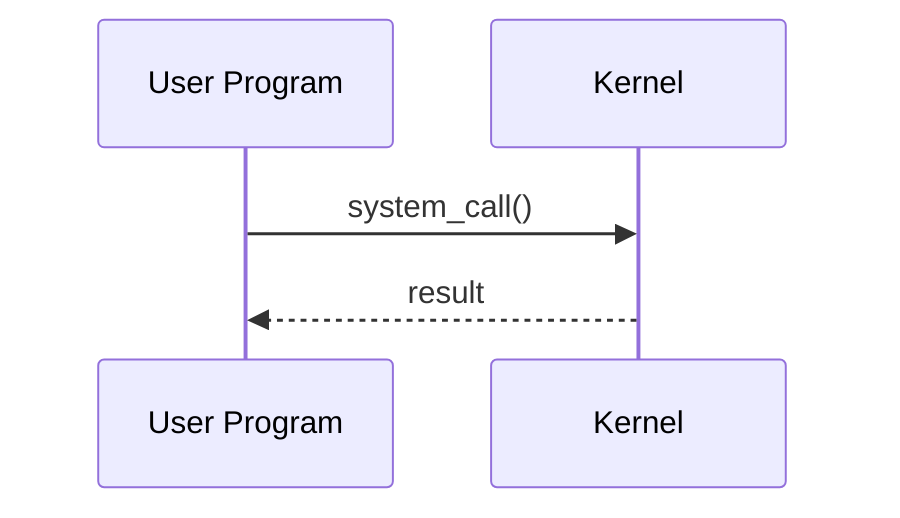

# `COMMAND` — Short Description

## Overview

Brief description of what this command does. Mention the package it belongs to, its standards compliance, and primary use cases.

**Command type**: External / Shell built-in  
**Package**: Package name  
**Location**: `/usr/bin/COMMAND`  
**Standard**: POSIX.1-2017 / GNU extension

---

## Syntax

```bash
COMMAND [OPTION]... [ARGUMENT]...
```

---

## Options Reference

### Primary Options

| Option | Long Form | Description |
|--------|-----------|-------------|
| `-x`   | `--example` | Description of what this does |
| `-y`   | `--another` | Description of what this does |
| `-z`   | `--third`   | Description of what this does |

### Output Format Options

| Option | Description |
|--------|-------------|
| `-l`   | Long format |
| `-h`   | Human-readable sizes |

---

## Examples

### Basic Usage

```bash
# Most common usage pattern
COMMAND argument

# With options
COMMAND -x argument

# Multiple arguments
COMMAND arg1 arg2
```

### Example 2: Description

```bash
COMMAND --option value
```

**Expected output:**
```
output line 1
output line 2
```

**Explanation:** What each part of the output means.

### Real-World Use Case

```bash
# Production-ready example with explanation
COMMAND -options | pipeline | processing
```

---

## Internal Working

How the command works internally — system calls, kernel involvement, etc.



### System Calls Used

| System Call | Purpose |
|-------------|---------|
| `call1()` | What it does |
| `call2()` | What it does |

---

## Kernel Details

Deep dive into kernel-level behavior, data structures involved, etc.

---

## Performance Notes

!!! tip "Performance tip"
    Specific advice for using this command efficiently at scale.

!!! warning "Avoid in scripts"
    Specific anti-patterns with this command.

---

## Best Practices

- Best practice 1
- Best practice 2
- Best practice 3

---

## Common Mistakes

!!! danger "Anti-pattern"
    ```bash
    # Do NOT do this
    BAD_EXAMPLE
    ```

!!! success "Correct approach"
    ```bash
    # Do this instead
    GOOD_EXAMPLE
    ```

---

## Troubleshooting

| Problem | Cause | Solution |
|---------|-------|----------|
| Error message 1 | Root cause | Fix |
| Error message 2 | Root cause | Fix |

---

## Related Commands

| Command | Relationship |
|---------|-------------|
| `related1` | Description |
| `related2` | Description |

---

## Interview Questions

??? question "Common interview question about this command?"
    Detailed answer demonstrating deep understanding.

??? question "Another interview question?"
    Detailed answer with examples.

---

## Practice Exercises

!!! example "Exercise 1: Basic usage"
    Task description. Expected solution below.
    ```bash
    # Solution
    COMMAND options
    ```

!!! example "Exercise 2: Advanced usage"
    Harder task description.

---

## References

- [Man page](https://man7.org/linux/man-pages/manX/COMMAND.X.html)
- [GNU documentation](https://www.gnu.org/software/coreutils/manual/)
- Relevant kernel source or specification
