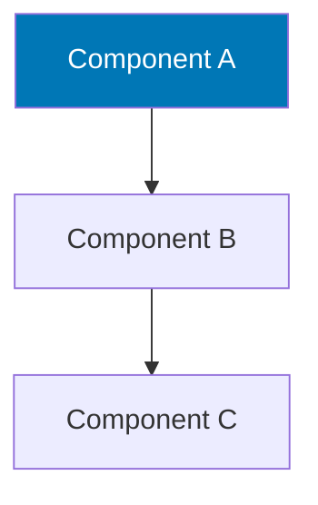
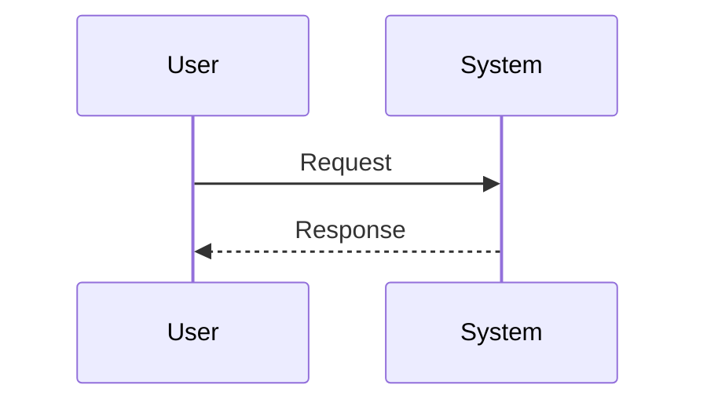

# Page Title

## Overview

Brief introduction (2–4 sentences). What is this topic, why does it exist, and what will the reader learn from this page.

---

## Why It Exists

Motivation and historical context. What problem does this solve? What did people do before it existed?

---

## Core Concepts

Define all key terms used in this page before using them.

Definition List
:   Explanation of the term

Another Term
:   Explanation

---

## Architecture

High-level structure and components.



---

## How It Works

Step-by-step explanation of the mechanism.



---

## Syntax / Configuration

```bash
# Basic syntax
command [options] <argument>
```

---

## Options & Parameters

| Option | Type | Default | Description |
|--------|------|---------|-------------|
| `--option1` | string | `default` | What this does |
| `--option2` | int | `0` | What this does |

---

## Examples

=== "Basic"

    ```bash
    # Simplest use case
    command argument
    ```

=== "Intermediate"

    ```bash
    # Common production pattern
    command --option value argument
    ```

=== "Advanced"

    ```bash
    # Complex use case with explanation
    command \
      --option1 value1 \
      --option2 value2 \
      argument
    ```

---

## Kernel Details *(if applicable)*

Relevant kernel subsystems, system calls, data structures.

---

## Performance Notes

!!! tip "Performance tip"
    Specific optimization advice.

---

## Best Practices

- [ ] Best practice 1 — explanation
- [ ] Best practice 2 — explanation
- [ ] Best practice 3 — explanation

---

## Common Mistakes

!!! danger "Mistake 1"
    What goes wrong and why.

!!! success "Correct approach"
    The right way to do it.

---

## Troubleshooting

| Symptom | Likely Cause | Solution |
|---------|-------------|----------|
| Issue 1 | Cause | Fix |
| Issue 2 | Cause | Fix |

---

## Interview Questions

??? question "Question 1 about this topic?"
    Comprehensive answer with technical depth.

??? question "Question 2 about this topic?"
    Comprehensive answer with technical depth.

---

## Practice Exercises

!!! example "Exercise 1"
    Task: ...
    
    Hint: ...
    
    Solution:
    ```bash
    # Answer
    ```

!!! example "Exercise 2"
    Task: ...

---

## Related Topics

<!-- Update these links to real pages:
- [Related Topic 1](../topic/index.md)
- [Related Topic 2](../topic/index.md)
-->

---

## References

- [Official documentation](https://example.com)
- [Man page](https://man7.org/linux/man-pages/)
- [Relevant kernel source](https://elixir.bootlin.com/linux/latest/source)
- [Further reading](https://example.com)

---

*Last reviewed: {{ git_revision_date_localized }}*
