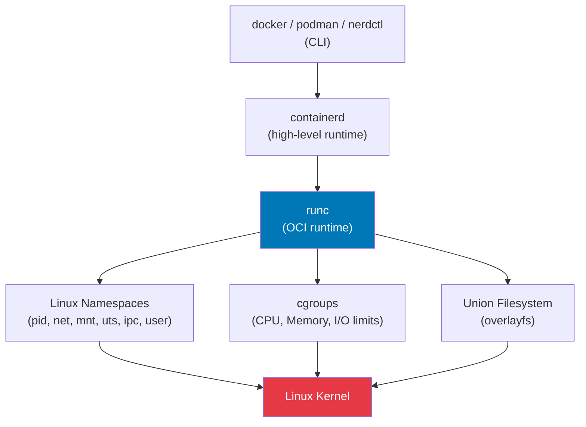

# Container Internals

## Overview

Containers are **not a separate technology** — they are processes on a Linux host, isolated using kernel namespaces and resource-limited with cgroups. Understanding containers means understanding Linux.

## Container Technology Stack



## What Makes a Container

=== "Namespaces (Isolation)"

    ```bash
    # What namespaces a container uses
    sudo lsns -p $(docker inspect --format '{{.State.Pid}}' mycontainer)

    # Manually create container-like isolation
    sudo unshare \
      --pid \
      --fork \
      --net \
      --mount \
      --uts \
      --ipc \
      --mount-proc \
      bash
    ```

=== "cgroups (Resource Limits)"

    ```bash
    # Container resource limits
    docker run --cpus=1.5 --memory=512m nginx

    # Find container cgroup
    docker inspect --format '{{.Id}}' nginx_container

    # View memory limit
    cat /sys/fs/cgroup/system.slice/docker-<HASH>.scope/memory.max
    ```

=== "Union Filesystem (overlayfs)"

    ```bash
    # Overlay layers: lower (read-only) + upper (read-write) = merged
    mount -t overlay overlay \
      -o lowerdir=/base,upperdir=/changes,workdir=/work \
      /merged

    # Docker overlay layers
    docker inspect --format '{{.GraphDriver}}' myimage
    ls /var/lib/docker/overlay2/
    ```

## Container vs VM

| Aspect | Container | Virtual Machine |
|--------|-----------|----------------|
| Isolation | Namespaces (kernel-level) | Hypervisor (hardware-level) |
| Overhead | ~1–5ms startup, MB RAM | ~1–30s startup, GB RAM |
| Kernel | Shared with host | Separate kernel |
| Security boundary | Weaker (shared kernel) | Stronger |
| Density | Hundreds per host | Tens per host |
| Use case | Microservices, CI/CD | Strong isolation, different OS |

## Building a Minimal Container

```bash
# Create a minimal root filesystem
mkdir /tmp/mycontainer
cd /tmp/mycontainer

# Copy a static binary (busybox)
cp /usr/bin/busybox .

# Run in isolation
sudo unshare --pid --fork --mount-proc --root /tmp/mycontainer \
  /busybox sh
```

## Interview Questions

??? question "What is the difference between a container image and a container?"
    A **container image** is a read-only, layered filesystem snapshot (like a class). A **container** is a running instance of an image (like an object). Multiple containers can run from the same image simultaneously, each with their own writable layer (overlayfs upper layer) that is discarded when the container stops.

??? question "Can two containers on the same host communicate? How?"
    Yes, multiple ways: (1) **Same network namespace / bridge**: Containers on the same Docker bridge (`docker0`) can communicate by container IP. (2) **Docker networks**: `docker network connect`. (3) **Host network**: `--network=host` shares the host network namespace. (4) **Unix sockets**: Mount a shared volume with a socket file. (5) **Port publishing**: Host port mapped to container port via NAT (iptables DNAT).
