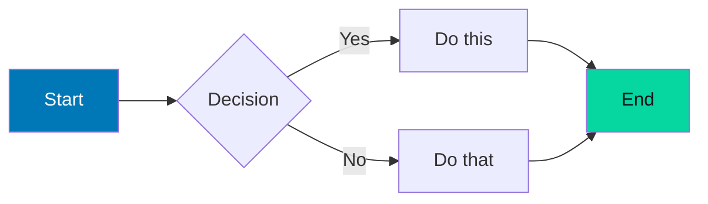
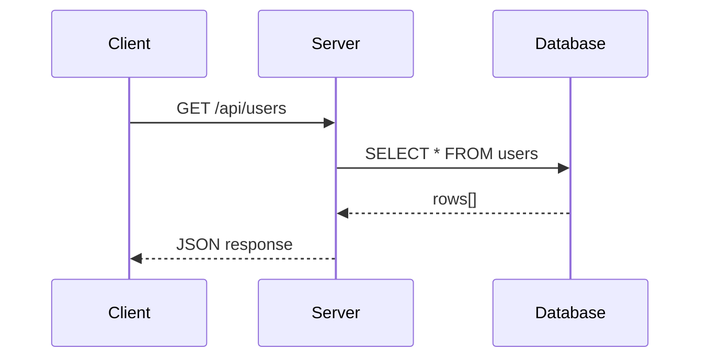
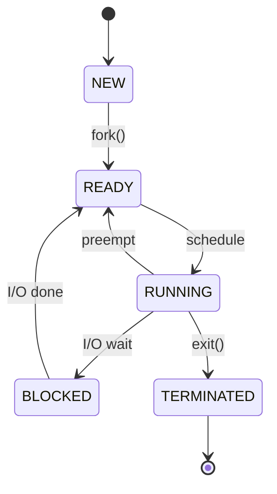

# Markdown Feature Showcase

This page demonstrates every supported Markdown and MkDocs-Material feature. Use it as a reference when writing documentation.

---

## Admonitions

!!! note "Note"
    Use for background context and additional information.

!!! tip "Tip"
    Use for best practices and efficiency suggestions.

!!! info "Info"
    Use for informational content that is helpful but not critical.

!!! warning "Warning"
    Use for potential problems and things to watch out for.

!!! danger "Danger"
    Use for critical warnings — data loss, security issues.

!!! success "Success"
    Use for correct approaches and positive outcomes.

??? question "Collapsible question block"
    This is collapsed by default. Click to expand.
    Perfect for interview questions and FAQs.

???+ example "Expanded details block"
    This is expanded by default. Click to collapse.

---

## Content Tabs

=== "Ubuntu / Debian"

    ```bash
    sudo apt update && sudo apt install nginx
    ```

=== "CentOS / RHEL"

    ```bash
    sudo yum install nginx
    ```

=== "Arch Linux"

    ```bash
    sudo pacman -S nginx
    ```

---

## Code Blocks

### With Syntax Highlighting

```python
def fibonacci(n: int) -> int:
    """Return the nth Fibonacci number."""
    if n <= 1:
        return n
    return fibonacci(n - 1) + fibonacci(n - 2)
```

```bash title="setup.sh"
#!/usr/bin/env bash
set -euo pipefail

install_packages() {
    local packages=("$@")
    apt-get install -y "${packages[@]}"
}

install_packages curl wget git vim
```

### With Line Numbers

```bash linenums="1"
#!/bin/bash
echo "Line 1"
echo "Line 2"
echo "Line 3"
```

### With Highlighted Lines

```bash hl_lines="2 4"
#!/bin/bash
IMPORTANT_VARIABLE="value"  # This line is highlighted
normal_line="other"
ANOTHER_IMPORTANT="line"    # This too
```

### With Code Annotations

```bash
server { # (1)!
    listen 80; # (2)!
    server_name example.com;
    
    location / { # (3)!
        proxy_pass http://localhost:3000;
    }
}
```

1. This defines an nginx server block
2. Listen on port 80 for HTTP traffic
3. All requests are proxied to the local app

### Inline Code

Use `ls -la` to list files, or `` `backtick` `` for code.

Inline with syntax: `#!python print("Hello")`

---

## Mermaid Diagrams

### Flowchart



### Sequence Diagram



### State Diagram



---

## Tables

### Basic Table

| Column 1 | Column 2 | Column 3 |
|----------|----------|----------|
| Value A  | Value B  | Value C  |
| Value D  | Value E  | Value F  |

### Aligned Table

| Left | Center | Right |
|:-----|:------:|------:|
| Left-aligned | Centered | Right-aligned |
| data | data | data |

---

## Lists

### Unordered

- Item 1
- Item 2
    - Nested item 2.1
    - Nested item 2.2
- Item 3

### Ordered

1. First step
2. Second step
    1. Sub-step 2.1
    2. Sub-step 2.2
3. Third step

### Task List

- [x] Completed task
- [x] Another completed task
- [ ] Pending task
- [ ] Another pending task

### Definition List

Term 1
:   Definition of term 1

Term 2
:   Definition of term 2.
    Can span multiple lines.

---

## Text Formatting

| Format | Syntax | Result |
|--------|--------|--------|
| Bold | `**text**` | **text** |
| Italic | `*text*` | *text* |
| Strikethrough | `~~text~~` | ~~text~~ |
| Highlight | `==text==` | ==text== |
| Superscript | `text^sup^` | text^sup^ |
| Subscript | `text~sub~` | text~sub~ |

---

## Keyboard Keys

Press ++ctrl+c++ to copy.  
Press ++ctrl+alt+t++ to open terminal.  
Use ++tab++ for autocomplete.  
Press ++escape++ to cancel.

---

## Mathematical Formulas

Inline: The Euler identity is $e^{i\pi} + 1 = 0$.

Block formula — Big-O notation:

$$
T(n) = O(n \log n)
$$

Block formula — integral:

$$
\int_{-\infty}^{\infty} e^{-x^2} dx = \sqrt{\pi}
$$

---

## Emoji

:penguin: Linux  
:rocket: Fast  
:lock: Secure  
:fire: Hot  
:white_check_mark: Done  
:warning: Caution  
:bulb: Tip

---

## Blockquotes

> "Those who do not understand Unix are condemned to reinvent it, poorly."
> 
> — Henry Spencer

Nested:

> Level 1
> > Level 2
> > > Level 3

---

## Footnotes

This sentence has a footnote.[^1]

Another footnote here.[^important]

[^1]: This is the first footnote.
[^important]: This is a more detailed footnote with **formatting** support.

---

## Abbreviations

The HTML specification is maintained by W3C.

*[HTML]: HyperText Markup Language
*[W3C]: World Wide Web Consortium

---

## Magic Links

GitHub: @Pruthviraj-333  
Issue: #42  
PR: !123

---

## Critic Markup (Track Changes)

Here is some {--deleted--} text and {++inserted++} text.  
Here is some {~~replaced~>replacement~~} text.  
Here is some {==highlighted==} text.  
Here is some {>>commented<<} text.

---

## HTML Blocks

Raw HTML can be embedded directly:

<div style="background:linear-gradient(135deg,#0077b6,#00b4d8);padding:1rem 1.5rem;border-radius:8px;color:#fff;margin:1rem 0;">
  <strong>Custom HTML Block</strong> — style anything with raw HTML when Markdown isn't enough.
</div>

---

## Images


*Caption: Images support lazy loading and zoom via glightbox*
