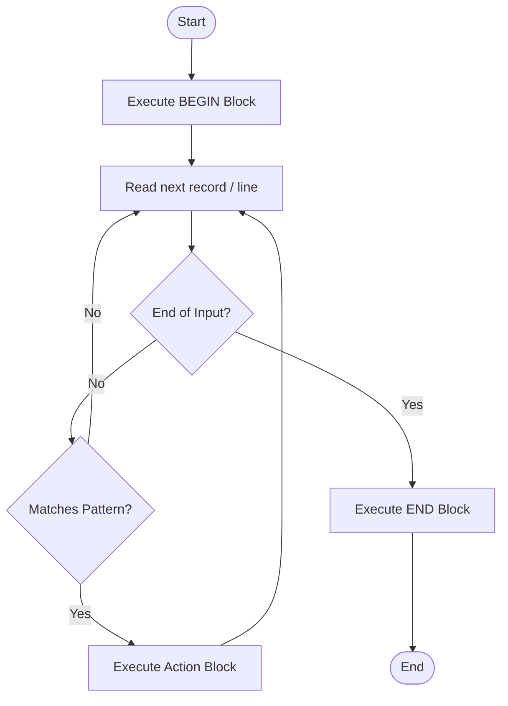

# `awk` — Pattern Scanning and Text Processing

## Overview

`awk` is a domain-specific programming language designed for text processing and data extraction. It processes input record by record (usually line by line) and splits each record into fields.

**Command type**: External (GNU awk / `gawk`)  
**Location**: `/usr/bin/awk`  
**Standard**: POSIX.1-2017

---

## Syntax

```bash
awk [OPTIONS] 'PATTERN { ACTION }' FILE...
```

---

## Key Built-In Variables

| Variable | Description |
|----------|-------------|
| `$0` | Entire current record/line |
| `$1, $2, ...` | Individual field values (1st, 2nd, etc.) |
| `NF` | Number of Fields in the current record |
| `$NF` | The value of the last field in the current record |
| `NR` | Number of Records processed so far (current line number across all files) |
| `FNR` | Record number in the current file |
| `FS` | Input Field Separator (default: space/tab) |
| `OFS` | Output Field Separator (default: space) |
| `RS` | Input Record Separator (default: newline) |
| `ORS` | Output Record Separator (default: newline) |

---

## Options Reference

| Option | Description |
|--------|-------------|
| `-F SEP` | Set Input Field Separator (FS) |
| `-v VAR=VAL` | Assign a variable value prior to execution |
| `-f FILE` | Read AWK program script from FILE |

---

## Examples

### Field Extraction

```bash
# Print first column (username) from /etc/passwd using ':' as separator
awk -F: '{print $1}' /etc/passwd

# Print username ($1) and login shell ($7) formatted with tab
awk -F: '{print $1 "\t" $7}' /etc/passwd
```

### Filtering with Patterns

```bash
# Print lines where the 3rd field (UID) is greater than or equal to 1000
awk -F: '$3 >= 1000 {print $1, $3}' /etc/passwd

# Filter lines matching a regular expression
awk '/ERROR/ {print $0}' app.log
```

### Using BEGIN and END Blocks

`BEGIN` actions run before any input is read; `END` actions run after all input is processed.

```bash
# Calculate average of numbers in column 2
awk '{sum += $2} END {print "Average:", sum/NR}' data.txt

# Print report header and footer
awk 'BEGIN {print "--- USER LIST ---"} {print $1} END {print "Total Users:", NR}' /etc/passwd
```

### Modifying Output Field Separator (OFS)

```bash
# Convert CSV to colon-separated file
awk 'BEGIN {FS=","; OFS=":"} {$1=$1; print $0}' data.csv
```

---

## How `awk` Executes (Execution Loop)



---

## Interview Questions

??? question "What is the difference between `NR` and `NF` in awk?"
    `NR` is the total **Number of Records** (line count) processed so far. `NF` is the **Number of Fields** in the current line. `$NF` evaluates to the value of the last field on the line.

??? question "How do you sum values in the second column of a file using awk?"
    ```bash
    awk '{sum += $2} END {print sum}' input.txt
    ```

---

## Related Commands

| Command | Description |
|---------|-------------|
| `sed` | Stream editor for filtering and transforming text |
| `cut` | Simple column extractor |
| `grep` | Text pattern matching |
