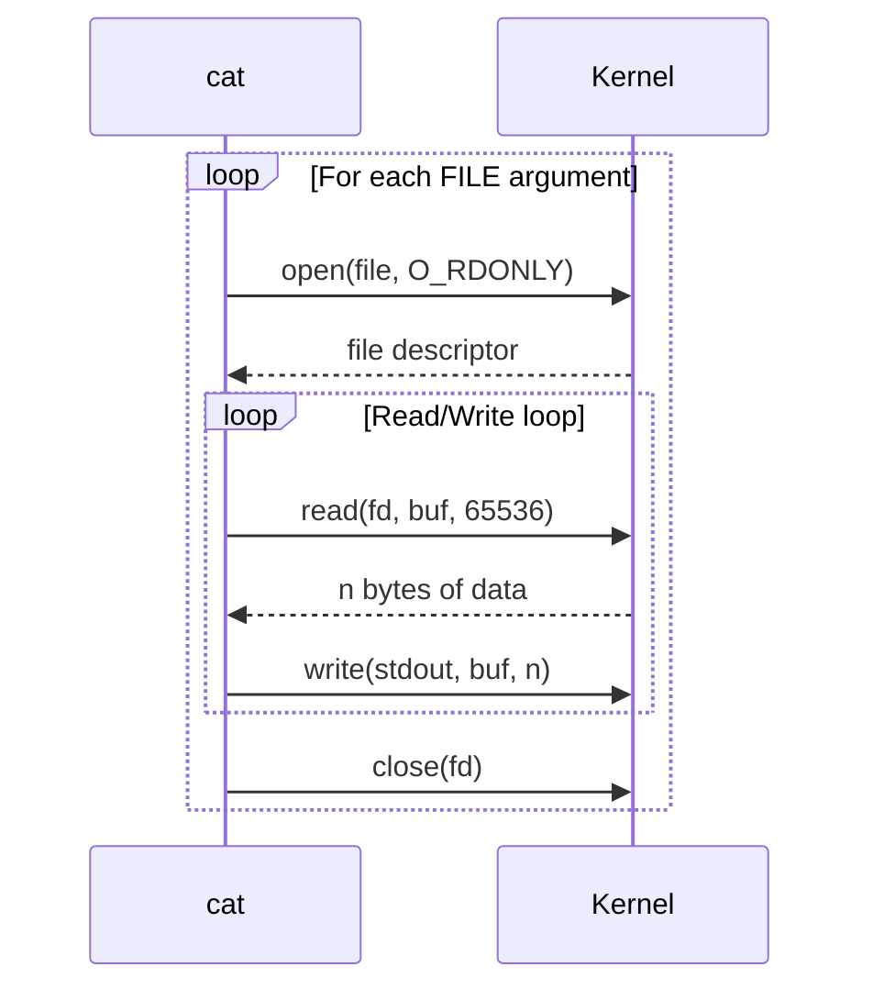

# `cat` — Concatenate and Display Files

## Overview

`cat` reads files sequentially and writes their content to standard output. The name stands for **concatenate** — its original purpose was to join multiple files together. It's also the most common way to quickly view a file's contents.

**Command type**: External (GNU coreutils)  
**Location**: `/usr/bin/cat`  
**Standard**: POSIX.1-2017

---

## Syntax

```bash
cat [OPTION]... [FILE]...
```

If no FILE is given (or FILE is `-`), `cat` reads from standard input.

---

## Options Reference

| Option | Long Form | Description |
|--------|-----------|-------------|
| `-n` | `--number` | Number all output lines |
| `-b` | `--number-nonblank` | Number non-blank lines only |
| `-s` | `--squeeze-blank` | Squeeze multiple adjacent blank lines into one |
| `-A` | `--show-all` | Show non-printing characters, tabs, and line endings |
| `-T` | `--show-tabs` | Show tab characters as `^I` |
| `-E` | `--show-ends` | Show `$` at end of each line |
| `-v` | `--show-nonprinting` | Show non-printing characters using `^` and `M-` notation |

---

## Examples

### View a File

```bash
# Print file to terminal
cat /etc/os-release

# View multiple files in sequence
cat /etc/hostname /etc/hosts
```

### Number Lines

```bash
# Number every line
cat -n script.sh

# Number only non-blank lines
cat -b script.sh
```

### Concatenate Files

```bash
# Join two files and save to a third
cat header.txt body.txt footer.txt > document.txt

# Append one file to another
cat extra.txt >> document.txt
```

### Create a File from Input

```bash
# Type content, end with Ctrl+D
cat > notes.txt
This is my note.
Press Ctrl+D to save.

# Heredoc — pipe multi-line content
cat > config.txt << 'EOF'
server=localhost
port=8080
debug=true
EOF
```

### Inspect Special Characters

```bash
# Show tabs (^I) and line endings ($)
cat -A script.sh

# Find Windows-style CRLF line endings (shows ^M$ at line ends)
cat -A file.txt | grep '\^M'
```

### Squeeze Blank Lines

```bash
# Remove extra blank lines (useful for cleaning up output)
cat -s verbose.txt
```

---

## Reading from stdin

```bash
# '-' explicitly means stdin
echo "header" | cat - file.txt
# Prints "header" then contents of file.txt

# Combine stdin and a file
ls /etc | cat - /etc/hostname
```

---

## How `cat` Works (Internals)



`cat` is intentionally simple — it reads in 64KB chunks and writes directly to stdout with minimal processing. When no options are used, it's essentially a passthrough for file data.

---

## Performance Notes

!!! warning "Don't use `cat` unnecessarily (Useless Use of Cat)"
    A very common anti-pattern is piping `cat` output unnecessarily:
    ```bash
    # Bad — spawns extra process for nothing
    cat file.txt | grep "error"

    # Good — grep reads the file directly
    grep "error" file.txt

    # Bad
    cat file.txt | wc -l

    # Good
    wc -l file.txt
    ```
    This is called a **UUOC (Useless Use of Cat)** and is a common beginner mistake.

!!! tip "For large files, use `less` instead"
    `cat` dumps the entire file to the terminal at once. For files with thousands of lines, use `less` for paginated viewing:
    ```bash
    less /var/log/syslog
    ```

---

## Interview Questions

??? question "What does the name `cat` stand for?"
    `cat` stands for **concatenate**. Its original purpose (and still a valid use) is to join multiple files together and write the result to stdout. For example, `cat file1 file2 > combined` concatenates two files into one.

??? question "What is a Useless Use of Cat (UUOC)?"
    It's the anti-pattern of piping `cat`'s output into a command that can read files directly. For example, `cat file | grep pattern` is worse than `grep pattern file` because it spawns an extra process. The term is widely used in Linux communities to point out this common inefficiency.

??? question "How do you create a multi-line file with cat?"
    You can use a **heredoc**: `cat > file.txt << 'EOF'` followed by content lines and a closing `EOF`. The shell redirects the heredoc content into `cat`'s stdin, and the `>` redirect writes the output to the file.

---

## Related Commands

| Command | Description |
|---------|-------------|
| `less` | View files page-by-page (better for large files) |
| `head` | View first N lines of a file |
| `tail` | View last N lines (and follow new output) |
| `tac` | `cat` in reverse — print file from last line to first |
| `more` | Older, simpler pager (use `less` instead) |
| `strings` | Extract printable text from binary files |
