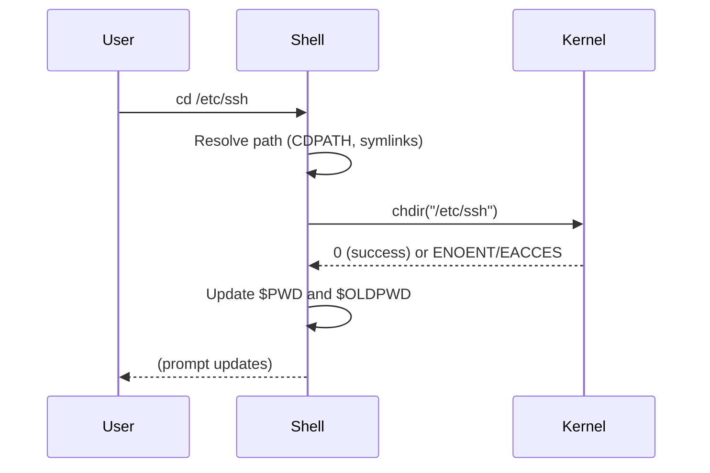

# `cd` — Change Directory

## Overview

`cd` changes the shell's current working directory. It is a **shell builtin** — not an external binary — meaning it modifies the shell process's own state directly.

**Command type**: Shell builtin  
**Standard**: POSIX.1-2017

---

## Syntax

```bash
cd [OPTION] [DIRECTORY]
```

If no `DIRECTORY` is given, `cd` navigates to `$HOME`.

---

## Special Directory Arguments

| Argument | Meaning |
|----------|---------|
| (none) | Go to `$HOME` |
| `~` | Go to `$HOME` |
| `-` | Go to previous directory (`$OLDPWD`) |
| `..` | Go up one level (parent directory) |
| `../..` | Go up two levels |
| `/` | Go to root directory |
| `.` | Stay in current directory (no-op) |

---

## Options

| Option | Description |
|--------|-------------|
| `-L` | Follow symbolic links (default) |
| `-P` | Use the physical path — resolve symlinks |
| `-e` | Exit with error if physical path cannot be determined (use with `-P`) |
| `-@` | On supported systems, open a file's extended attribute namespace |

---

## Examples

### Basic Navigation

```bash
# Go to home directory
cd
cd ~
cd $HOME

# Go to root
cd /

# Go to a specific path
cd /etc/ssh

# Go to a relative path
cd Documents/projects
```

### Toggle Between Two Directories

```bash
cd /var/log
cd /etc/nginx
cd -            # → goes back to /var/log
cd -            # → goes back to /etc/nginx
```

### Navigate Up

```bash
cd ..           # one level up
cd ../..        # two levels up
cd ../../etc    # up two levels, then into etc
```

### Using Variables

```bash
LOGDIR=/var/log
cd "$LOGDIR"
cd "$LOGDIR/nginx"
```

### Physical vs Logical Path

```bash
# If /var/run is a symlink to /run:
cd -L /var/run    # pwd shows /var/run (logical)
cd -P /var/run    # pwd shows /run (physical)
```

---

## How `cd` Works (Shell Internals)

`cd` is a **builtin** because changing directories is a process-level operation — it calls the `chdir()` system call on the **current shell process**. If it were an external binary, the directory change would only affect the child process and would be lost when the command returned.



### Key Shell Variables

| Variable | Set By | Meaning |
|----------|--------|---------|
| `$PWD` | Shell | Current working directory |
| `$OLDPWD` | Shell | Previous working directory |
| `$HOME` | Shell/environment | Default `cd` target |
| `$CDPATH` | User | Colon-separated search path for `cd` |

---

## CDPATH — Search Path for cd

`CDPATH` lets you `cd` into frequently used subdirectories from anywhere:

```bash
# Add project dirs to CDPATH
export CDPATH=".:$HOME/projects:/opt"

# Now anywhere you are:
cd myapp      # finds ~/projects/myapp automatically
cd nginx      # finds /opt/nginx automatically
```

---

## Interview Questions

??? question "Why is `cd` a shell builtin and not an external command?"
    Because `chdir()` changes the directory of the **calling process**. If `cd` were a separate binary, it would fork a child process, change *that* process's directory, then exit — leaving the parent shell unchanged. As a builtin, `cd` calls `chdir()` directly in the shell process, so the change persists for future commands.

??? question "What does `cd -` do and how does it work?"
    `cd -` changes to the directory stored in `$OLDPWD`, which the shell automatically sets to the previous value of `$PWD` before each successful `cd`. It's equivalent to `cd $OLDPWD`. This makes it easy to toggle between two directories.

??? question "What is the difference between `cd -L` and `cd -P`?"
    `-L` (default) follows symbolic links and sets `$PWD` to the logical path (the path as you typed it, including symlink names). `-P` uses the *physical* path — it resolves all symlinks and sets `$PWD` to the true, canonical filesystem path. This matters when you need to know the actual inode path, e.g., for tools that don't follow symlinks.

---

## Related Commands

| Command | Description |
|---------|-------------|
| `pwd` | Print current working directory |
| `pushd` / `popd` | Stack-based directory navigation |
| `dirs` | List directory stack |
| `ls` | List contents of current directory |
| `realpath` | Resolve symlinks to canonical path |
