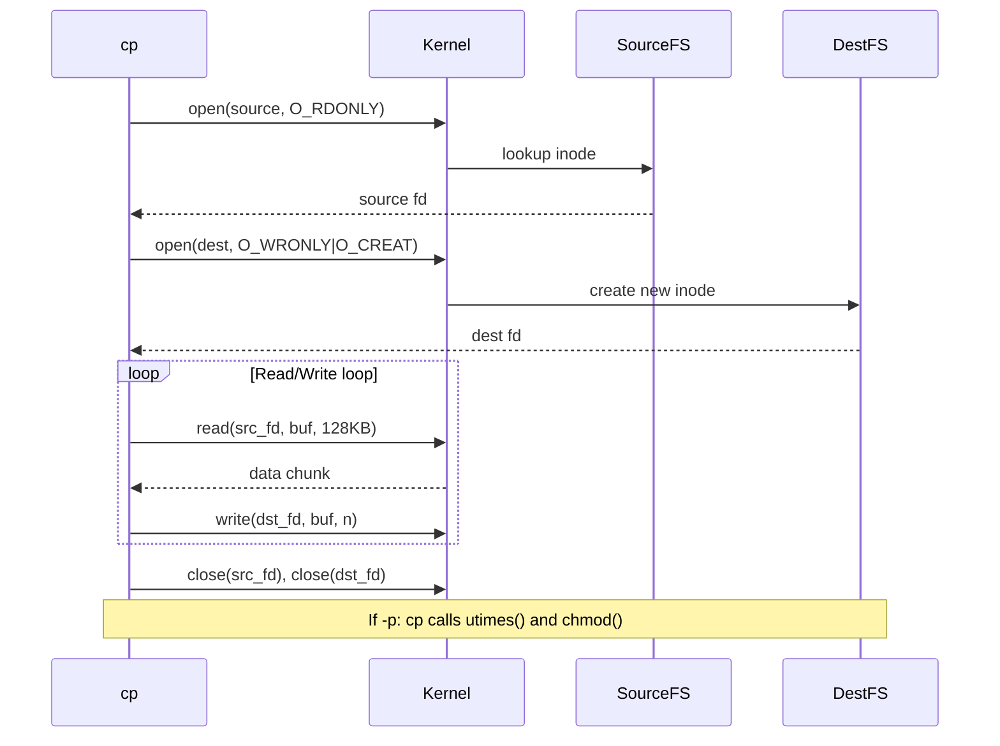

# `cp` — Copy Files and Directories

## Overview

`cp` copies files and directories. It reads the source file's data and metadata, then writes it to the destination. Understanding `cp`'s flags is essential for safe, efficient file operations.

**Command type**: External (GNU coreutils)  
**Location**: `/usr/bin/cp`  
**Standard**: POSIX.1-2017

---

## Syntax

```bash
cp [OPTION]... SOURCE DEST
cp [OPTION]... SOURCE... DIRECTORY
cp [OPTION]... -t DIRECTORY SOURCE...
```

---

## Options Reference

### Core Behaviour

| Option | Long Form | Description |
|--------|-----------|-------------|
| `-r` / `-R` | `--recursive` | Copy directories recursively |
| `-a` | `--archive` | Archive mode: preserves everything (`-dR --preserve=all`) |
| `-p` | `--preserve` | Preserve timestamps, permissions, ownership |
| `-n` | `--no-clobber` | Do not overwrite existing files |
| `-f` | `--force` | Remove destination and retry if cannot open |
| `-i` | `--interactive` | Prompt before overwriting |
| `-u` | `--update` | Copy only when source is newer than dest |
| `-v` | `--verbose` | Print each file as it is copied |

### Symlinks

| Option | Description |
|--------|-------------|
| `-P` | Never follow symlinks in SOURCE |
| `-L` | Always follow symlinks in SOURCE |
| `-d` | Same as `--no-dereference --preserve=links` |

### Preservation

| Option | Description |
|--------|-------------|
| `--preserve=mode` | Preserve permissions |
| `--preserve=timestamps` | Preserve atime and mtime |
| `--preserve=ownership` | Preserve owner and group |
| `--preserve=links` | Preserve hard links |
| `--preserve=all` | Preserve everything |

---

## Examples

### Basic Copy

```bash
# Copy file
cp file.txt backup.txt

# Copy to a directory
cp file.txt /tmp/

# Copy multiple files to a directory
cp file1.txt file2.txt file3.txt /tmp/
```

### Copy Directories

```bash
# Must use -r for directories
cp -r /etc/nginx /tmp/nginx-backup

# Archive mode — preserves permissions, timestamps, symlinks
cp -a /etc/nginx /tmp/nginx-backup
```

### Safe Copies (No Overwrite)

```bash
# Don't overwrite existing files
cp -n source.txt dest.txt

# Prompt before overwriting
cp -i source.txt dest.txt

# Only overwrite if source is newer
cp -u source.txt dest.txt
```

### Verbose Output

```bash
cp -rv /var/www/html /tmp/html-backup
# 'html/index.html' -> '/tmp/html-backup/index.html'
# 'html/css/style.css' -> '/tmp/html-backup/css/style.css'
```

### Preserve Metadata

```bash
# Preserve timestamps and permissions
cp -p /etc/passwd /tmp/passwd.bak

# Full archive with all attributes
cp -a /home/pruthvi /backup/pruthvi
```

### Copy to Specific Target with -t

```bash
# Useful with find/xargs
find . -name "*.log" | xargs cp -t /tmp/logs/
```

---

## Internal Working

When `cp` copies a file, the following happens at the kernel level:



### Key System Calls

| System Call | Purpose |
|-------------|---------|
| `open()` | Open source for reading, create destination |
| `read()` | Read source data in chunks |
| `write()` | Write data to destination |
| `fstat()` | Get source file metadata |
| `chmod()` | Apply permission mode (with `-p`) |
| `utimes()` | Apply timestamps (with `-p`) |
| `lchown()` | Apply ownership (root only, with `-p`) |

### Why `-a` Is Preferred for Backups

```bash
cp -a /source /dest
```

`-a` is equivalent to `-dR --preserve=all`. It:
- Copies directories **recursively**
- Preserves all **timestamps** (access, modify, change)
- Preserves **ownership** (requires root for other users)
- Preserves **permissions** (setuid, setgid, sticky bit)
- Preserves **symlinks** as symlinks (does not follow them)
- Preserves **hard links** within the source tree

---

## Performance Notes

!!! tip "Large file copies"
    For very large files, `cp` is efficient but limited to sequential I/O. For faster copies between local disks, consider:
    ```bash
    # Using ionice to lower I/O priority
    ionice -c 3 cp -r /source /dest

    # Or use rsync for resumable copies
    rsync -av --progress /source/ /dest/
    ```

!!! warning "Copy vs move across filesystems"
    `mv` between different filesystems must read all data and write it to the new location (like `cp` + `rm`). On the same filesystem, `mv` is instant (just renames the directory entry). `cp` always reads and writes regardless.

---

## Common Mistakes

!!! danger "Trailing slash behaviour"
    ```bash
    # Source dir without slash — copies the dir itself into dest
    cp -r /etc/nginx /tmp/backup     # creates /tmp/backup/nginx/

    # To copy contents only (not the directory itself), use rsync
    rsync -a /etc/nginx/ /tmp/backup/
    ```

!!! warning "Symlinks in source"
    By default, `cp -r` follows symlinks and copies the target content. Use `-d` or `--no-dereference` to copy the symlink itself.

---

## Interview Questions

??? question "What is the difference between `cp -r` and `cp -a`?"
    `-r` (recursive) copies directory contents recursively but does not preserve metadata. `-a` (archive) is shorthand for `-dR --preserve=all` — it recursively copies and preserves all attributes: timestamps, ownership, permissions, and symlinks. Use `-a` for backups, `-r` for simple copies.

??? question "Why does `cp` create a new inode even when copying on the same filesystem?"
    Unlike `mv` (which renames a directory entry pointing to the same inode), `cp` always creates a **new file** with a new inode, reads the source data, and writes it to the new location. This means `cp` takes time proportional to file size, even on the same filesystem.

??? question "How can you copy only newer files?"
    Use `cp -u` (update), which skips the copy if the destination file exists and is newer than the source. For more powerful syncing, use `rsync -u`.

---

## Related Commands

| Command | Description |
|---------|-------------|
| `mv` | Move or rename files |
| `rm` | Remove files |
| `rsync` | Efficient file synchronisation (resumable) |
| `ln` | Create hard or symbolic links |
| `install` | Copy files and set attributes (used in Makefiles) |
