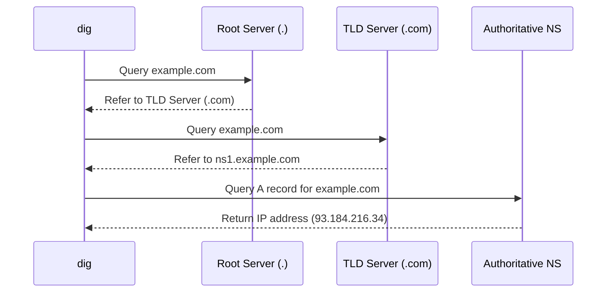

# `dig` — Domain Information Groper (DNS Lookup)

## Overview

`dig` (Domain Information Groper) is a flexible tool for querying DNS name servers. It performs DNS lookups and displays the answers that are returned from the queried name server(s).

**Command type**: External (bind-utils / dnsutils)  
**Location**: `/usr/bin/dig`

---

## Syntax

```bash
dig [@SERVER] NAME [TYPE] [OPTIONS]
```

---

## Record Types Reference

| Type | Description |
|------|-------------|
| `A` | IPv4 address record |
| `AAAA` | IPv6 address record |
| `CNAME` | Canonical name (domain alias) |
| `MX` | Mail exchange server record |
| `TXT` | Text record (used for SPF, DKIM, verification) |
| `NS` | Name server record |
| `SOA` | Start of Authority record |
| `ANY` | Query all available record types |

---

## Examples

### Basic DNS Query

```bash
dig google.com
```

### Querying Specific Record Types

```bash
# Query IPv4 address (A record)
dig google.com A

# Query Mail servers (MX record)
dig google.com MX

# Query TXT records (SPF / Domain verification)
dig google.com TXT
```

### Short Output (IP Address Only)

```bash
dig google.com +short
```

Sample output:
```
142.250.190.46
```

### Querying a Specific Name Server

```bash
# Query Google's public DNS (8.8.8.8)
dig @8.8.8.8 example.com

# Query Cloudflare's public DNS (1.1.1.1)
dig @1.1.1.1 example.com A
```

### Trace DNS Delegation (+trace)

```bash
# Trace resolution from root servers down to authoritative server
dig +trace example.com
```

---

## How DNS Resolution Works (Trace Flow)



---

## Interview Questions

??? question "How do you trace the complete DNS path for a domain using dig?"
    Use `dig +trace domain.com`. This starts at the root DNS servers (`.`) and follows the delegation hierarchy down through TLD servers to the authoritative DNS server.

---

## Related Commands

| Command | Description |
|---------|-------------|
| `nslookup` | Interactive / legacy DNS query tool |
| `host` | Simple DNS lookup utility |
