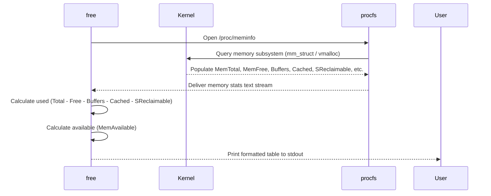

# `free` — Display Amount of Free and Used Memory

## Overview

`free` displays the total amount of free and used physical memory (RAM) and swap memory in the system, as well as the buffers and caches used by the kernel. It reads data directly from `/proc/meminfo`.

**Command type**: External (procps-ng)  
**Location**: `/usr/bin/free`

---

## Syntax

```bash
free [OPTIONS]
```

---

## Options Reference

| Option | Long Form | Description |
|--------|-----------|-------------|
| `-b` | `--bytes` | Display memory in bytes |
| `-k` | `--kilo` | Display memory in kilobytes (default) |
| `-m` | `--mega` | Display memory in megabytes |
| `-g` | `--giga` | Display memory in gigabytes |
| `-h` | `--human` | Display all fields automatically scaled to human-readable units (e.g. 1G, 500M) |
| `-w` | `--wide` | Switch to wide mode (separates buffers and cache) |
| `-c N` | `--count=N` | Display output N times then exit |
| `-s N` | `--seconds=N` | Continuously display memory stats every N seconds |
| `-t` | `--total` | Display a line showing column totals |

---

## Examples

### Human-Readable Memory View (Most Common)

```bash
free -h
```

Sample output:

```
               total        used        free      shared  buff/cache   available
Mem:           15Gi       3.2Gi       7.1Gi       245Mi       4.7Gi        11Gi
Swap:           2.0Gi          0B       2.0Gi
```

### Separating Buffers and Cache (Wide View)

```bash
free -h -w
```

Sample output:

```
               total        used        free      shared     buffers       cache   available
Mem:           15Gi       3.2Gi       7.1Gi       245Mi       320Mi       4.4Gi        11Gi
Swap:           2.0Gi          0B       2.0Gi
```

### Continuous Memory Monitoring

```bash
# Monitor memory usage every 2 seconds for 5 iterations
free -h -s 2 -c 5
```

---

## Understanding Memory Fields

| Field | Description |
|-------|-------------|
| `total` | Total installed RAM / swap capacity |
| `used` | Memory currently allocated by processes (`total - free - buff/cache`) |
| `free` | Memory that is completely unallocated |
| `shared` | Memory used by `tmpfs` (shmem) and shared memory segments |
| `buffers` | Kernel memory used for block device I/O buffering |
| `cache` | Kernel memory used for page cache (cached files on disk) |
| `buff/cache` | Combined sum of `buffers` and `cache` |
| `available` | Estimated memory available for starting new applications without swapping |

!!! note "Linux Uses Free RAM for Caching"
    Unused RAM is wasted RAM. Linux automatically utilizes unused memory for page cache (`buff/cache`) to speed up disk I/O. If applications need memory, the kernel instantly reclaims page cache memory. Therefore, high `buff/cache` usage is completely normal and healthy.

---

## How `free` Works (Internals)



---

## Interview Questions

??? question "What is the difference between 'free' memory and 'available' memory in free output?"
    `free` memory represents RAM that is completely unallocated and idle. `available` memory estimates how much RAM is actually usable for new applications without triggering swap — it includes `free` memory plus reclaimable page cache and slab buffers.

??? question "Why does a Linux system often show very little 'free' memory even when idle?"
    Linux follows the philosophy that "free RAM is wasted RAM." It automatically uses idle memory as a page cache to store frequently accessed files from disk. When processes require more memory, the kernel reclaims cache instantly.

---

## Related Commands

| Command | Description |
|---------|-------------|
| `vmstat` | Report virtual memory, swap, and CPU statistics |
| `top` | Interactive real-time process and memory viewer |
| `cat /proc/meminfo` | View raw kernel memory metrics |
