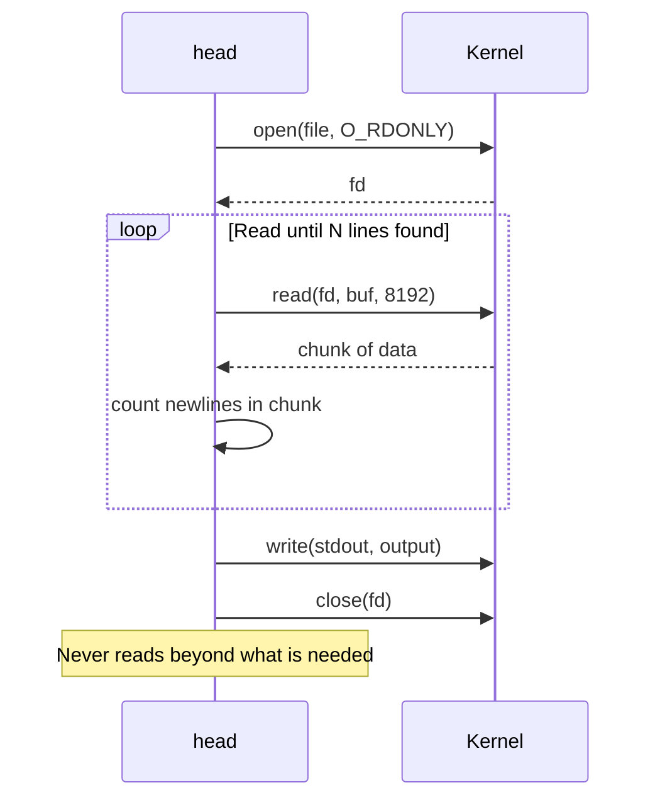

# `head` — View First Lines of a File

## Overview

`head` prints the **first N lines** (or bytes) of one or more files. By default it shows the first **10 lines**. It is one of the fastest ways to inspect a file without loading the entire content.

**Command type**: External (GNU coreutils)  
**Location**: `/usr/bin/head`  
**Standard**: POSIX.1-2017

---

## Syntax

```bash
head [OPTION]... [FILE]...
```

If no FILE is given, `head` reads from standard input.

---

## Options Reference

| Option | Long Form | Description |
|--------|-----------|-------------|
| `-n N` | `--lines=N` | Print first N lines (default: 10) |
| `-c N` | `--bytes=N` | Print first N bytes |
| `-q` | `--quiet` | Never print file headers (useful with multiple files) |
| `-v` | `--verbose` | Always print file headers |
| `-z` | `--zero-terminated` | Line delimiter is NUL, not newline |

---

## Examples

### Basic Usage

```bash
# Show first 10 lines (default)
head /var/log/syslog

# Show first 20 lines
head -n 20 /var/log/syslog

# Show first 5 lines
head -5 /etc/passwd
```

### View Multiple Files

```bash
# Shows a header before each file's output
head -n 5 /etc/hostname /etc/hosts /etc/resolv.conf
# ==> /etc/hostname <==
# myserver
#
# ==> /etc/hosts <==
# 127.0.0.1 localhost
# ...
```

### First N Bytes

```bash
# Show first 100 bytes
head -c 100 /dev/urandom | xxd

# Show first 1 KB
head -c 1024 largefile.bin
```

### Skip the Last N Lines

```bash
# Print everything EXCEPT the last 5 lines
# (negative syntax: -n -N)
head -n -5 file.txt
```

### Use in Pipelines

```bash
# Top 10 most CPU-consuming processes
ps aux --sort=-%cpu | head -n 11

# First 5 results of a search
grep "ERROR" app.log | head -5

# Preview first line of each .conf file
for f in /etc/*.conf; do echo "==> $f"; head -1 "$f"; done
```

### Check File Type / Magic Bytes

```bash
# Inspect first bytes of a binary to identify file type
head -c 4 file.bin | xxd
# 00000000: 7f45 4c46 ...  → ELF binary
# 00000000: 504b 0304 ...  → ZIP archive
```

---

## How `head` Works (Internals)

`head` reads the file sequentially from the beginning and stops as soon as it has collected enough lines or bytes. For line mode, it counts newline characters. Once the target count is reached, it calls `close()` on the file — it never reads the rest, making it very efficient even on multi-gigabyte files.



---

## Interview Questions

??? question "What does `head -n -5` do?"
    It prints all lines of the file **except the last 5**. The negative value tells `head` to stop 5 lines before the end of the file. This is supported by GNU head but may not be portable to all POSIX systems.

??? question "How would you view the first 10 lines of a compressed log file?"
    Use process substitution or a pipe:
    ```bash
    zcat file.log.gz | head
    # or
    head <(zcat file.log.gz)
    ```

---

## Related Commands

| Command | Description |
|---------|-------------|
| `tail` | View last N lines of a file |
| `cat` | View entire file |
| `less` | Page through file interactively |
| `sed -n '1,10p'` | Print lines 1–10 using sed |
| `awk 'NR<=10'` | Print first 10 lines using awk |
