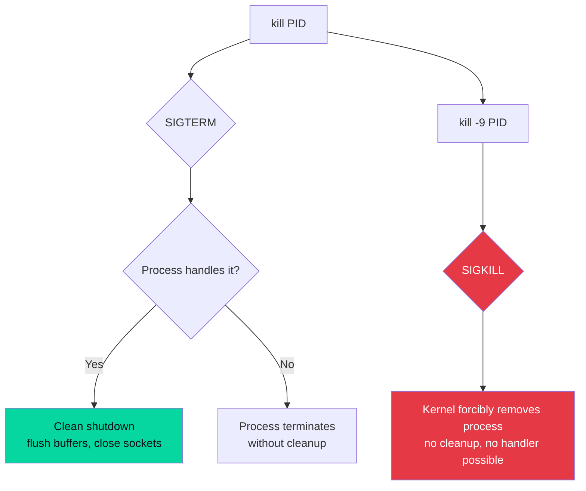
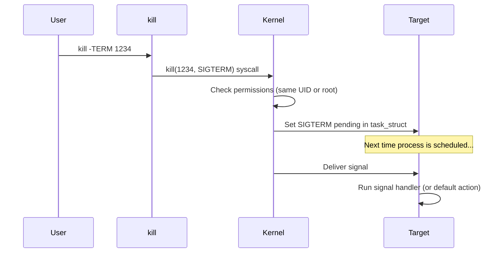

# `kill` — Send Signals to Processes

## Overview

`kill` sends a **signal** to a process identified by its PID. Despite the name, it does not only terminate processes — it can send any of the 64 Linux signals, including `SIGHUP` (reload config), `SIGSTOP` (pause), or `SIGCONT` (resume).

**Command type**: Shell builtin AND external (`/usr/bin/kill`)  
**Standard**: POSIX.1-2017

---

## Syntax

```bash
kill [OPTION] PID...
kill -SIGNAL PID...
kill -l [SIGNAL]
```

---

## Signal Reference Table

| Signal | Number | Default Action | Common Use |
|--------|--------|----------------|-----------|
| `SIGHUP` | 1 | Terminate | Reload config without restart |
| `SIGINT` | 2 | Terminate | Interrupt (same as Ctrl+C) |
| `SIGQUIT` | 3 | Core dump | Quit with core dump |
| `SIGKILL` | 9 | Terminate (cannot be caught) | Force kill — always works |
| `SIGTERM` | 15 | Terminate | Graceful shutdown (default) |
| `SIGSTOP` | 19 | Stop (cannot be caught) | Pause a process |
| `SIGCONT` | 18 | Continue | Resume a stopped process |
| `SIGUSR1` | 10 | Terminate | App-defined action |
| `SIGUSR2` | 12 | Terminate | App-defined action |
| `SIGWINCH` | 28 | Ignore | Terminal window resized |

```bash
# List all signals
kill -l
```

---

## Options Reference

| Option | Description |
|--------|-------------|
| `-SIGNAL` | Signal to send (name or number) |
| `-s SIGNAL` | Specify signal by name |
| `-l` | List all signal names |
| `-l N` | Print name of signal number N |

---

## Examples

### Graceful Termination (Default)

```bash
# Send SIGTERM (15) — the default
kill 1234

# Explicit SIGTERM
kill -TERM 1234
kill -15 1234
```

### Force Kill

```bash
# SIGKILL cannot be caught, blocked, or ignored
kill -9 1234
kill -KILL 1234

# Kill multiple PIDs
kill -9 1234 5678 9012
```

### Reload Configuration (No Restart)

```bash
# SIGHUP tells many daemons to reload their config
kill -HUP $(pgrep nginx)
kill -HUP $(pgrep sshd)

# Reload systemd itself
kill -HUP 1
```

### Pause and Resume a Process

```bash
# Pause (SIGSTOP cannot be caught — always works)
kill -STOP 1234

# Resume
kill -CONT 1234
```

### Kill by Name (Using pgrep)

```bash
# Find PID first, then kill
PID=$(pgrep -x nginx)
kill -TERM "$PID"

# Or combine with pkill (kills by name directly)
pkill nginx
pkill -9 zombie_process
```

### Kill All Processes in a Group

```bash
# Negative PID targets an entire process group
kill -TERM -1234    # Kill process group 1234 (negative sign)
```

---

## SIGTERM vs SIGKILL



!!! warning "When to use SIGKILL"
    Only use `kill -9` as a last resort. `SIGKILL` gives the process no chance to:
    - Flush write buffers to disk
    - Close network connections gracefully
    - Release locks or clean up temp files
    Always try `kill` (SIGTERM) first, wait a few seconds, then escalate to `kill -9` if needed.

---

## How Signals Work (Internals)

When you run `kill -TERM 1234`:



Signals are delivered asynchronously — the kernel marks the signal as pending in the target process's `task_struct`, then delivers it the next time the process is scheduled to run.

---

## Permission Rules

| Sender | Can kill |
|--------|---------|
| Regular user | Processes they own |
| `root` | Any process |

```bash
# Check if you can kill a process
ls -l /proc/1234/   # See owner of the process directory
```

---

## Interview Questions

??? question "What is the difference between SIGTERM and SIGKILL?"
    `SIGTERM` (15) is a **request** to terminate — the process can catch it, perform cleanup (flush buffers, close connections, remove temp files), and then exit gracefully. A process can also ignore or block `SIGTERM`. `SIGKILL` (9) is a **forced termination** sent directly by the kernel — it cannot be caught, blocked, or ignored. The kernel immediately removes the process from the process table. Use `SIGTERM` first; only escalate to `SIGKILL` if the process doesn't respond.

??? question "What does `kill -0 PID` do?"
    Sending signal 0 does not actually send any signal to the process. It is used purely to **check if a process exists and if you have permission to send it signals**. Exit code 0 means the process exists and you have permission; exit code 1 means it doesn't exist or you lack permission. This is useful in scripts: `kill -0 $PID 2>/dev/null && echo "running"`.

??? question "Why can't you kill a process in D state with SIGKILL?"
    A process in `D` state (uninterruptible sleep) is waiting for I/O in the kernel and is not schedulable. Since signals are delivered when a process is next scheduled, `SIGKILL` is marked as pending but never delivered while the process stays in `D` state. You must resolve the underlying I/O issue (e.g., unmount a hung NFS share) to allow the process to exit.

---

## Related Commands

| Command | Description |
|---------|-------------|
| `pkill` | Kill processes by name or pattern |
| `killall` | Kill all processes with a given name |
| `pgrep` | Find PIDs by process name |
| `ps` | List processes and their states |
| `top` / `htop` | Interactive process manager with kill support |
| `trap` | Set signal handlers in shell scripts |
