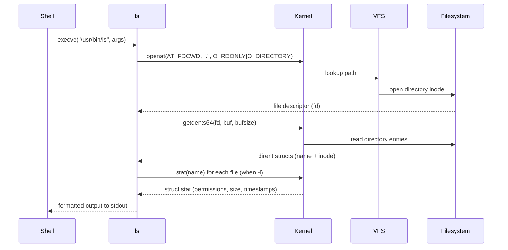

# `ls` — List Directory Contents

## Overview

`ls` lists files and directories in the filesystem. It is one of the most frequently used Linux commands and the starting point for understanding the filesystem. Despite its simplicity, `ls` has dozens of options that reveal metadata hidden by default.

**Command type**: External (GNU coreutils)  
**Location**: `/usr/bin/ls`  
**Standard**: POSIX.1-2017

---

## Syntax

```bash
ls [OPTION]... [FILE]...
```

If no `FILE` is given, the current directory (`.`) is listed.

---

## Options Reference

### Display Options

| Option | Long Form | Description |
|--------|-----------|-------------|
| `-l`   | `--format=long` | Long listing format (permissions, owner, size, date) |
| `-a`   | `--all` | Show hidden files (starting with `.`) |
| `-A`   | `--almost-all` | Show hidden files, but not `.` and `..` |
| `-h`   | `--human-readable` | Human-readable sizes (KB, MB, GB) — use with `-l` |
| `-s`   | `--size` | Print allocated block size of each file |
| `-i`   | `--inode` | Print the inode number |
| `-d`   | `--directory` | List directory itself, not its contents |
| `-R`   | `--recursive` | List subdirectories recursively |
| `-1`   |  | One file per line |

### Sorting Options

| Option | Description |
|--------|-------------|
| `-t`   | Sort by modification time (newest first) |
| `-S`   | Sort by file size (largest first) |
| `-X`   | Sort by file extension |
| `-r`   | Reverse the sort order |
| `-U`   | Do not sort — list in directory order (fastest) |
| `--sort=none` | Same as `-U` |

### Color & Format Options

| Option | Description |
|--------|-------------|
| `--color=auto` | Colorize output when writing to a terminal |
| `-F` / `--classify` | Append type indicator (`/` dir, `*` exec, `@` symlink, `=` socket) |
| `-p`   | Append `/` to directory names |
| `-Q`   | Quote file names with double quotes |
| `--group-directories-first` | List directories before files |

---

## Examples

### Basic Usage

```bash
# List current directory
ls

# List a specific path
ls /var/log

# List multiple paths
ls /etc /usr /var
```

### Long Listing

```bash
ls -l /etc/passwd
```

```
-rw-r--r-- 1 root root 2847 Jan 15 09:22 /etc/passwd
```

**Output breakdown:**

| Field | Value | Meaning |
|-------|-------|---------|
| File type | `-` | Regular file (`d`=dir, `l`=link, `b`=block, `c`=char, `p`=pipe, `s`=socket) |
| Permissions | `rw-r--r--` | Owner: read+write, Group: read, Others: read |
| Hard links | `1` | Number of hard links to this inode |
| Owner | `root` | File owner username |
| Group | `root` | Owning group |
| Size | `2847` | Size in bytes (use `-h` for human-readable) |
| Timestamp | `Jan 15 09:22` | Last modification time (mtime) |
| Name | `/etc/passwd` | Filename or path |

### Show Hidden Files

```bash
ls -la ~
```

```
total 96
drwxr-xr-x  8 pruthvi pruthvi 4096 Jan 15 10:00 .
drwxr-xr-x 12 root    root    4096 Jan 10 08:00 ..
-rw-------  1 pruthvi pruthvi 2048 Jan 15 09:55 .bash_history
-rw-r--r--  1 pruthvi pruthvi  220 Jan 10 08:00 .bash_logout
-rw-r--r--  1 pruthvi pruthvi 3526 Jan 10 08:00 .bashrc
drwxr-xr-x  4 pruthvi pruthvi 4096 Jan 12 14:00 .config
-rw-r--r--  1 pruthvi pruthvi  807 Jan 10 08:00 .profile
```

### Sort by Time (Newest First)

```bash
ls -lt /var/log
```

### Human-Readable Sizes

```bash
ls -lh /var/log/syslog
```

```
-rw-r--r-- 1 syslog adm 4.2M Jan 15 10:03 /var/log/syslog
```

### Show Inode Numbers

```bash
ls -li /etc/passwd /etc/shadow
```

```
1048578 -rw-r--r-- 1 root root   2847 Jan 15 09:22 /etc/passwd
1048579 -rw-r----- 1 root shadow 1423 Jan 15 09:22 /etc/shadow
```

!!! info "Inodes"
    An inode number uniquely identifies a file within a filesystem.
    Two hard links to the same file share the same inode number.

### List Only Directories

```bash
# Using -d with glob
ls -ld /etc/*/

# Or with find
find /etc -maxdepth 1 -type d
```

### Recursive Listing

```bash
ls -R /etc/ssh/
```

### Sort by Size

```bash
# Largest files first in /var/log
ls -lhS /var/log | head -10
```

---

## Internal Working

When you run `ls`, the following happens:



Key system calls used by `ls`:

| System Call | Purpose |
|-------------|---------|
| `openat()` | Open the directory |
| `getdents64()` | Read directory entries (efficient batch read) |
| `lstat()` / `stat()` | Get file metadata for each entry |
| `readlink()` | Resolve symlink targets (for `-l`) |
| `write()` | Write formatted output to stdout |

---

## Kernel Details

### Directory Entries (dentries)

The kernel maintains a **dentry cache (dcache)** mapping filename strings to inode numbers. When `ls` calls `getdents64()`, the kernel:

1. Looks up the directory's inode
2. Reads the directory's data blocks from disk (or cache)
3. Returns `linux_dirent64` structures containing:
   - `d_ino` — inode number
   - `d_reclen` — record length
   - `d_type` — file type (DT_REG, DT_DIR, DT_LNK, etc.)
   - `d_name` — null-terminated filename

### Why `ls -l` is Slower

With `-l`, `ls` must call `stat()` (or `lstat()`) on **every** file to retrieve permissions, timestamps, and sizes. This results in N+1 system calls:

```
1 × getdents64  → get filenames
N × lstat       → get metadata for each file
```

For large directories, this can be slow. Use `-U` (no sort) and pipe to `head` for fast checks.

### inode and Hard Links

```bash
# Create a hard link
ln /etc/passwd /tmp/passwd-hardlink

# Both files share the same inode
ls -li /etc/passwd /tmp/passwd-hardlink
```

Both will show the same inode number. The link count in `ls -l` output shows how many directory entries point to this inode.

---

## Performance Notes

!!! tip "Fast directory listing"
    For directories with millions of files:
    ```bash
    # Skip sorting (fastest)
    ls -1U /massive-dir | wc -l

    # Or use find (even more control)
    find /massive-dir -maxdepth 1 -printf '%f\n' | wc -l
    ```

!!! warning "Avoid `ls` in scripts"
    Parsing `ls` output is unreliable — filenames can contain spaces, newlines, and special characters. Use `find`, `globbing`, or arrays instead:
    ```bash
    # Bad — breaks with spaces in filenames
    for f in $(ls /path/); do ...

    # Good — handles all filenames safely
    for f in /path/*; do ...

    # Or with find
    find /path -maxdepth 1 -type f -print0 | while IFS= read -r -d '' f; do ...
    ```

---

## Best Practices

- Always use `ls -lh` over `ls -l` for human-readable sizes
- Use `--color=auto` in your shell alias (usually already set in `.bashrc`)
- In scripts, prefer `find` or glob patterns over parsing `ls`
- Use `ls -la` when debugging hidden config files
- Use `ls -lS | head` to quickly find the largest files

---

## Common Mistakes

!!! danger "Parsing `ls` output in scripts"
    ```bash
    # ❌ Never do this — breaks with special characters in filenames
    files=$(ls /path/to/dir)

    # ✅ Use glob expansion or find
    files=(/path/to/dir/*)
    ```

!!! warning "`ls` aliases can hide real behaviour"
    Many distros alias `ls` to `ls --color=auto`. If you see unexpected color in a script, use `/usr/bin/ls` or `\ls` to bypass aliases.

---

## Troubleshooting

| Problem | Cause | Solution |
|---------|-------|----------|
| `ls: cannot access '/path': No such file or directory` | Path doesn't exist | Check path spelling; use `find` to search |
| `ls: cannot open directory '/root': Permission denied` | Insufficient permissions | Use `sudo ls /root` |
| Output is not sorted | Using `-U` | Remove `-U` or add `-t`/`-S` |
| Colors not showing | `--color=never` or piped | Add `--color=always` or use `ls` interactively |
| Symlinks shown as `?` | Broken symlink | Use `ls -la` to see target; `readlink -f` to resolve |

---

## Related Commands

| Command | Description |
|---------|-------------|
| `dir` | GNU version similar to `ls` |
| `find` | Advanced file search with metadata filtering |
| `stat` | Detailed file metadata (all timestamps, inode info) |
| `file` | Determine file type by content inspection |
| `tree` | Recursive directory tree view |
| `lsof` | List open files by process |
| `du` | Disk usage per directory |
| `exa` / `eza` | Modern `ls` replacement with git integration |

---

## Interview Questions

??? question "What is the difference between `.` and `..`?"
    `.` refers to the current directory. `..` refers to the parent directory. Both are special directory entries maintained by the kernel in every directory. They are always visible with `ls -a`.

??? question "What does the number `2` mean in `ls -l` output?"
    It is the **hard link count** — the number of directory entries that reference this inode. For a regular file, this is usually 1. Directories always have at least 2 (the directory entry itself and the `.` inside it). Each subdirectory adds another via `..`.

??? question "Why does `ls -l` show sizes in bytes but `du` shows different numbers?"
    `ls -l` shows the **logical file size** (content size). `du` shows the **disk usage** — the actual blocks allocated on disk. Due to sparse files, filesystem block alignment, and metadata overhead, these numbers differ.

??? question "What is `getdents64` and why is it used instead of `readdir`?"
    `getdents64` is a Linux-specific system call that reads multiple directory entries in a single call (batch), making it much faster than the POSIX `readdir()` which calls the kernel once per entry. Modern `ls` uses `getdents64` internally.

---

## Practice Exercises

!!! example "Exercise 1: Understand the output"
    Run `ls -la /etc/ssh/` and explain every field in the output of `sshd_config`.

!!! example "Exercise 2: Find large files"
    List the 5 largest files in `/var/log` sorted by size, showing human-readable sizes.
    ```bash
    ls -lhS /var/log | head -6
    ```

!!! example "Exercise 3: Count files"
    Count the number of regular files in `/usr/bin` without using `find`.
    ```bash
    ls -1 /usr/bin | wc -l
    ```

!!! example "Exercise 4: Inode inspection"
    Create a hard link and verify both files share the same inode number.
    ```bash
    touch /tmp/original
    ln /tmp/original /tmp/hardlink
    ls -li /tmp/original /tmp/hardlink
    ```

---

## References

- [GNU Coreutils: `ls` manual](https://www.gnu.org/software/coreutils/manual/html_node/ls-invocation.html)
- [POSIX: `ls` specification](https://pubs.opengroup.org/onlinepubs/9699919799/utilities/ls.html)
- [Linux man page: `getdents64(2)`](https://man7.org/linux/man-pages/man2/getdents64.2.html)
- [Linux man page: `stat(2)`](https://man7.org/linux/man-pages/man2/stat.2.html)
