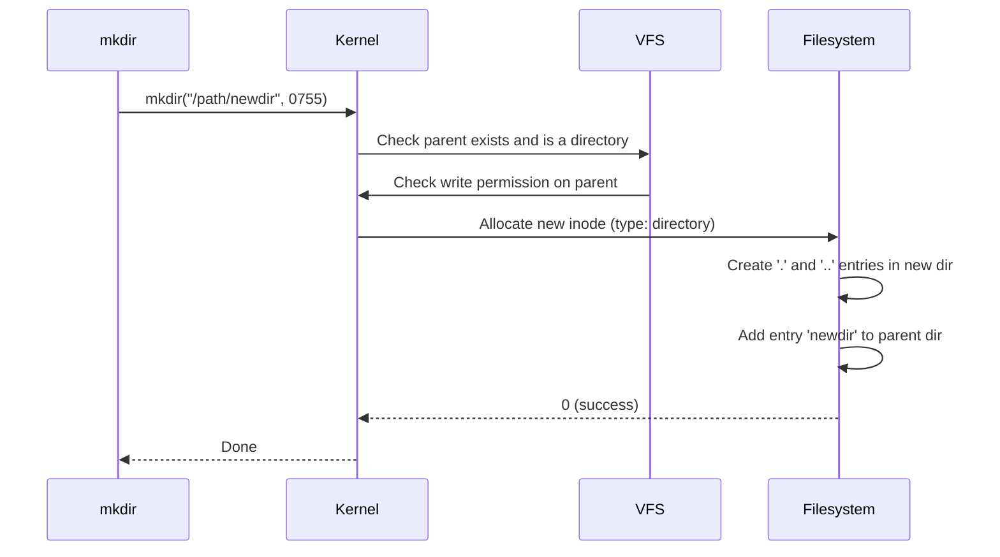

# `mkdir` — Create Directories

## Overview

`mkdir` creates new directories. It can create a single directory or an entire nested path in one command with the right flag.

**Command type**: External (GNU coreutils)  
**Location**: `/usr/bin/mkdir`  
**Standard**: POSIX.1-2017

---

## Syntax

```bash
mkdir [OPTION]... DIRECTORY...
```

---

## Options Reference

| Option | Long Form | Description |
|--------|-----------|-------------|
| `-p` | `--parents` | Create parent directories as needed; no error if already exists |
| `-m MODE` | `--mode=MODE` | Set permission mode (like `chmod`), instead of default `umask` |
| `-v` | `--verbose` | Print a message for each created directory |

---

## Examples

### Create a Single Directory

```bash
mkdir projects
mkdir /tmp/test-dir
```

### Create Nested Directories (Most Useful)

```bash
# Without -p, this fails if 'src' does not exist
mkdir -p projects/myapp/src/utils

# Create multiple paths at once
mkdir -p logs/{nginx,apache,app}
```

### Set Permissions at Creation Time

```bash
# Create with rwxr-x--- (750) permissions
mkdir -m 750 secure-dir

# Create nested path with specific permissions
mkdir -p -m 755 /var/www/mysite/public
```

### Verbose Output

```bash
mkdir -pv /opt/myapp/{bin,conf,logs,data}
# mkdir: created directory '/opt/myapp'
# mkdir: created directory '/opt/myapp/bin'
# mkdir: created directory '/opt/myapp/conf'
# mkdir: created directory '/opt/myapp/logs'
# mkdir: created directory '/opt/myapp/data'
```

---

## How Directories Are Created (Internals)

A directory is just a **special file** in the filesystem that maps filenames to inode numbers. When `mkdir` runs, it calls the `mkdir()` system call:



Every newly created directory automatically contains two special entries:

| Entry | Points To | Meaning |
|-------|-----------|---------|
| `.` | The directory itself | Refers to "this directory" |
| `..` | The parent directory | Used to navigate upward |

---

## Permissions and umask

By default, `mkdir` creates directories with permissions `0777 & ~umask`. With a typical `umask` of `022`:

```bash
umask        # → 0022
mkdir newdir
ls -ld newdir
# drwxr-xr-x 2 user group 4096 Jul 27 10:00 newdir/
# 0777 & ~0022 = 0755
```

Use `-m` to override the umask:

```bash
mkdir -m 700 private-dir    # Only owner can read/write/execute
```

---

## Interview Questions

??? question "What is the difference between `mkdir dir` and `mkdir -p dir`?"
    `mkdir dir` fails with an error if a parent directory in the path does not exist, or if `dir` itself already exists. `mkdir -p dir` silently creates all missing parent directories and does not error if the final directory already exists. `-p` is safe to use in scripts where the directory may or may not exist.

??? question "What two special entries does every new directory contain?"
    Every directory is created with `.` (a hard link to itself) and `..` (a hard link to its parent directory). This is why the link count of a new empty directory starts at 2 — one from the parent's directory entry and one from its own `.` entry.

??? question "How does `mkdir -p logs/{nginx,apache}` work?"
    This uses **brace expansion** — a bash feature that expands the `{}` expression into multiple arguments before passing them to `mkdir`. The shell expands it to `mkdir -p logs/nginx logs/apache`, creating both subdirectories in one command.

---

## Related Commands

| Command | Description |
|---------|-------------|
| `rmdir` | Remove empty directories |
| `rm -r` | Remove directories and their contents |
| `ls -ld` | Show directory permissions |
| `chmod` | Change directory permissions |
| `install -d` | Create directory with specific permissions in one step |
