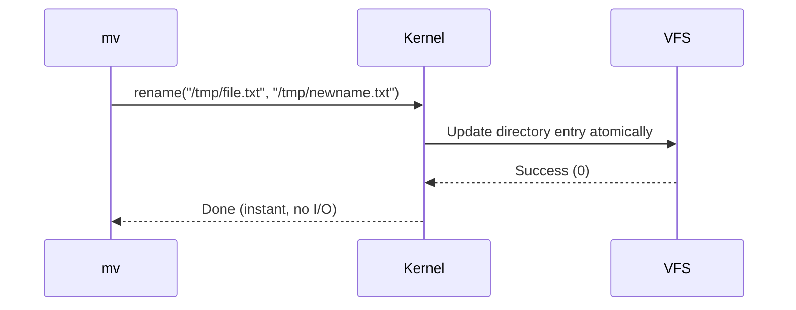
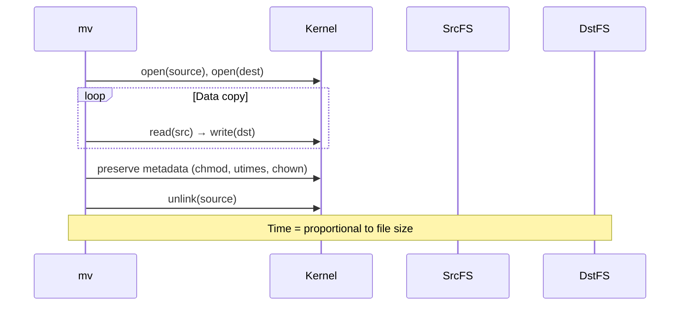

# `mv` — Move / Rename Files

!!! tip "Quick Start / TL;DR Cheat Sheet"
    - **`mv old.txt new.txt`** — Rename a file or folder
    - **`mv file.txt /tmp/`** — Move a file into another folder
    - **`mv -i src.txt dst.txt`** — Safe move: prompts before overwriting any file
    - **`mv *.log /var/archive/`** — Move multiple files at once

## Overview

The `mv` (Move) command is used to move files to a different folder or rename them.

---

## Syntax

```bash
mv [OPTION]... SOURCE DEST
mv [OPTION]... SOURCE... DIRECTORY
mv [OPTION]... -t DIRECTORY SOURCE...
```

---

## Options Reference

| Option | Long Form | Description |
|--------|-----------|-------------|
| `-i` | `--interactive` | Prompt before overwriting |
| `-n` | `--no-clobber` | Do not overwrite existing files |
| `-f` | `--force` | Do not prompt before overwriting |
| `-u` | `--update` | Move only when source is newer than dest |
| `-v` | `--verbose` | Print each file as it is moved |
| `-t DIR` | `--target-directory=DIR` | Move all sources to DIR |
| `-b` | `--backup` | Make backup of each existing destination |
| `--suffix=S` | | Use suffix S instead of `~` for backups |

---

## Examples

### Rename a File

```bash
# Rename file in the same directory
mv old_name.txt new_name.txt

# Rename a directory
mv my-project my-project-v2
```

### Move Files

```bash
# Move to a different directory
mv file.txt /tmp/

# Move multiple files at once
mv *.log /var/archive/

# Move with explicit target
mv -t /var/archive/ *.log *.gz
```

### Safe Move (No Overwrite)

```bash
# Prompt before overwriting
mv -i source.txt dest.txt

# Never overwrite
mv -n source.txt dest.txt

# Move only if source is newer
mv -u source.txt dest.txt
```

### Backup Existing Destination

```bash
# Creates dest.txt~ as a backup
mv --backup source.txt dest.txt

# Custom suffix
mv --backup --suffix=.bak source.txt dest.txt
# Creates dest.txt.bak
```

### Verbose Output

```bash
mv -v *.conf /etc/myapp/
# 'app.conf' -> '/etc/myapp/app.conf'
# 'db.conf' -> '/etc/myapp/db.conf'
```

---

## Internal Working

### Same Filesystem (Rename — Instant)

On the same filesystem, `mv` calls the `rename()` system call. This atomically changes the directory entry — no data is read or written:



### Different Filesystem (Copy + Delete)

Across filesystems, `mv` must copy all data then remove the source:



### Key System Calls

| System Call | Used When | Purpose |
|-------------|-----------|---------|
| `rename()` | Same filesystem | Atomic rename — instant |
| `open()` + `read()` + `write()` | Cross-filesystem | Copy data |
| `unlink()` | Cross-filesystem | Delete source after copy |
| `stat()` | Always | Check if source/dest exist |
| `chmod()` / `utimes()` | Cross-filesystem | Preserve metadata |

### Atomicity of `rename()`

```bash
# This is atomic — dest either exists or doesn't, never partial
mv /tmp/newconfig.conf /etc/app.conf

# Used in safe config deployments:
# 1. Write to temp file
# 2. Rename atomically to final location
echo "new config" > /etc/app.conf.tmp
mv /etc/app.conf.tmp /etc/app.conf   # atomic!
```

---

## Performance Notes

!!! tip "Same-filesystem moves are always instant"
    `mv` within the same filesystem is O(1) regardless of file size. It's just updating a directory entry. But `mv /home/user/file /tmp/file` may cross a filesystem boundary and require a full copy.

!!! tip "Check if a path crosses a filesystem"
    ```bash
    stat -c "%d" /home/user/file  # inode device number
    stat -c "%d" /tmp/file        # compare — same = same FS
    ```

---

## Common Mistakes

!!! danger "Overwriting files silently"
    By default, `mv` overwrites the destination without warning. Use `-i` in interactive sessions:
    ```bash
    # Add to your ~/.bashrc
    alias mv='mv -i'
    ```

!!! warning "mv across filesystem is not atomic"
    Cross-filesystem `mv` is a copy + delete. If the system crashes mid-copy, you may end up with a partial destination and the original source gone (if the source was already unlinked). Use `rsync` for safe cross-filesystem moves.

---

## Interview Questions

??? question "When is `mv` instantaneous and when is it slow?"
    `mv` is instantaneous (O(1)) when source and destination are on the **same filesystem** — it calls `rename()` which is a single atomic VFS operation. It's slow (proportional to file size) when crossing filesystem boundaries, because the kernel must copy all data from source to destination, then unlink the source.

??? question "Is `mv` atomic?"
    On the same filesystem, yes — `rename()` is atomic. The file either has the old name or the new name, never both, never neither. Across filesystems, no — it's a multi-step copy + delete which can fail partway through.

??? question "What happens if `mv` is interrupted mid-transfer across filesystems?"
    If the copy completes but `unlink()` hasn't run yet, you'll have both the original and the copy. If the copy is interrupted, you'll have a partial destination file. This is why `rsync` (with `--partial`) is safer for large cross-filesystem transfers.

---

## Related Commands

| Command | Description |
|---------|-------------|
| `cp` | Copy files (without removing source) |
| `rm` | Remove files |
| `rename` | Bulk rename using Perl regex |
| `rsync` | Resilient file synchronisation |
| `install` | Copy + set permissions in one step |
