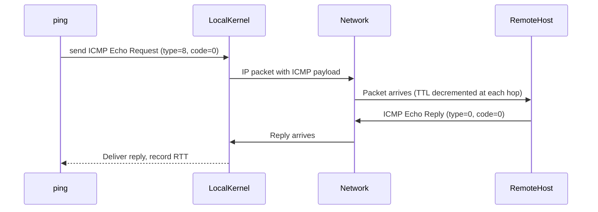

# `ping` — Test Network Connectivity

## Overview

`ping` sends **ICMP Echo Request** packets to a target host and reports whether replies are received, along with round-trip times. It is the first tool used in any network troubleshooting workflow.

**Command type**: External (iputils)  
**Location**: `/usr/bin/ping`  
**Standard**: RFC 792 (ICMP)

---

## Syntax

```bash
ping [OPTIONS] DESTINATION
```

---

## Options Reference

| Option | Description |
|--------|-------------|
| `-c N` | Send exactly N packets, then stop |
| `-i N` | Wait N seconds between each packet (default: 1) |
| `-t TTL` | Set IP Time-to-Live |
| `-s SIZE` | Set ICMP data payload size in bytes (default: 56) |
| `-W N` | Timeout N seconds waiting for a reply |
| `-q` | Quiet — only show summary |
| `-v` | Verbose |
| `-4` | Force IPv4 |
| `-6` | Force IPv6 |
| `-I IFACE` | Use a specific network interface |
| `-f` | Flood ping (root only) — sends as fast as possible |
| `-D` | Print timestamp (Unix time) before each line |

---

## Examples

### Basic Connectivity Check

```bash
# Ping Google's DNS server (Ctrl+C to stop)
ping 8.8.8.8

# Ping a hostname
ping google.com

# Force IPv4 or IPv6
ping -4 google.com
ping -6 google.com
```

### Send Specific Number of Packets

```bash
# Send exactly 5 packets
ping -c 5 8.8.8.8

# Quick connectivity check in scripts
if ping -c 1 -W 2 8.8.8.8 &>/dev/null; then
    echo "Network reachable"
else
    echo "Network unreachable"
fi
```

### Test Packet Loss and Latency

```bash
# Send 100 packets, quiet output (only shows summary)
ping -c 100 -q 8.8.8.8
```

---

## How ICMP Ping Works (Internals)



---

## Interview Questions

??? question "What protocol does ping use?"
    `ping` uses **ICMP (Internet Control Message Protocol)**, specifically ICMP Echo Request (type 8) and Echo Reply (type 0). ICMP operates at Layer 3 (network layer) and is part of IP — it has no TCP/UDP port numbers.

??? question "If ping fails, does it mean the host is down?"
    Not necessarily. Many firewalls block ICMP packets, so a host can be fully operational but not respond to pings.

---

## Related Commands

| Command | Description |
|---------|-------------|
| `traceroute` | Show each hop the packet takes to the destination |
| `mtr` | Combines ping and traceroute in a live view |
| `ip` | Check local interface addresses and routes |
