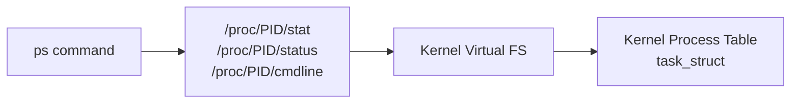

# `ps` — Report Process Status

## Overview

`ps` takes a snapshot of the currently running processes and displays information about them. It reads data from the `/proc` virtual filesystem — making it a window directly into the kernel's process table.

**Command type**: External (procps)  
**Location**: `/usr/bin/ps`  
**Standard**: POSIX.1-2017

!!! note "Two syntax styles"
    `ps` supports **POSIX/UNIX style** (options with `-`) and **BSD style** (options without `-`). They behave slightly differently. The most common invocation `ps aux` is BSD-style.

---

## Syntax

```bash
ps [OPTIONS]
```

---

## Most Common Invocations

```bash
# All processes (BSD style) — MOST COMMONLY USED
ps aux

# All processes (UNIX style) with full format
ps -ef

# All processes in a wide tree format
ps axjf

# Watch processes in real time (use top instead, but this works)
watch -n 1 'ps aux --sort=-%cpu | head -20'
```

---

## Options Reference

### Process Selection

| Option | Description |
|--------|-------------|
| `a` (BSD) | Show processes from all users (not just current user) |
| `x` (BSD) | Include processes without a controlling terminal |
| `-e` / `-A` | Select all processes |
| `-u USER` | Select processes by user |
| `-p PID` | Select by PID |
| `-C CMD` | Select by command name |
| `--ppid PID` | Select by parent PID |
| `-g GRP` | Select by process group |

### Output Format

| Option | Description |
|--------|-------------|
| `u` (BSD) | User-oriented format (shows %CPU, %MEM, etc.) |
| `-f` | Full format (shows PPID, UID, C, STIME) |
| `-l` | Long format |
| `-o FORMAT` | User-defined output columns |
| `j` | Jobs format (PGID, SID) |
| `f` | Show ASCII process tree |

### Sorting

| Option | Description |
|--------|-------------|
| `--sort=KEY` | Sort by column; prefix with `-` to reverse |

---

## Output Columns Explained

### `ps aux` Output

```
USER       PID %CPU %MEM    VSZ   RSS TTY      STAT START   TIME COMMAND
root         1  0.0  0.1 169772 10412 ?        Ss   Jan15   0:03 /sbin/init
```

| Column | Meaning |
|--------|---------|
| `USER` | Owner of the process |
| `PID` | Process ID |
| `%CPU` | CPU usage percentage |
| `%MEM` | Physical memory (RSS) as % of total RAM |
| `VSZ` | Virtual memory size in KB |
| `RSS` | Resident Set Size — physical RAM used in KB |
| `TTY` | Controlling terminal (`?` = no terminal) |
| `STAT` | Process state (see below) |
| `START` | Time the process started |
| `TIME` | Cumulative CPU time used |
| `COMMAND` | Command with arguments |

### Process States (STAT column)

| State | Meaning |
|-------|---------|
| `R` | Running or runnable (in run queue) |
| `S` | Sleeping (interruptible — waiting for event) |
| `D` | Uninterruptible sleep (usually waiting on I/O) |
| `Z` | Zombie — finished, but parent hasn't called `wait()` |
| `T` | Stopped (by signal or by debugger) |
| `I` | Idle kernel thread |
| `s` | Session leader |
| `+` | In the foreground process group |
| `l` | Multi-threaded |
| `N` | Low priority (nice > 0) |
| `<` | High priority (nice < 0) |

---

## Examples

### View All Running Processes

```bash
# Standard full view
ps aux

# Sort by CPU usage (highest first)
ps aux --sort=-%cpu | head -20

# Sort by memory usage
ps aux --sort=-%mem | head -20
```

### Find a Specific Process

```bash
# Find nginx processes
ps aux | grep nginx

# Better: use -C to select by command name
ps -C nginx

# Get PID of a process by name
pgrep nginx
ps -C nginx -o pid=
```

### Custom Output Columns

```bash
# Show only PID, user, CPU, memory, and command
ps -eo pid,user,%cpu,%mem,comm

# Show PID, PPID, state, and command — sorted by PPID
ps -eo pid,ppid,stat,comm --sort=ppid

# Show process tree with PIDs
ps -eo pid,ppid,comm f
```

### Process Tree

```bash
# ASCII tree showing parent/child relationships
ps axjf
# or
ps --forest -eo pid,ppid,comm
```

### Check a Specific PID

```bash
# Check details for PID 1234
ps -p 1234
ps -p 1234 -o pid,user,stat,cmd

# Check multiple PIDs
ps -p 1,2,1234
```

### Find Zombie Processes

```bash
ps aux | awk '$8 == "Z" {print $1, $2, $11}'
```

---

## Understanding VSZ vs RSS

```bash
ps aux --sort=-%mem | head -5
```

| Metric | What it is | Gotcha |
|--------|-----------|--------|
| `VSZ` | Total virtual address space claimed | Includes mmap'd libraries, unallocated heap — usually much larger than actual usage |
| `RSS` | Physical RAM pages currently resident | Counts shared library pages once per process — can overcount total actual usage |

For true memory accounting, use `/proc/PID/smaps_rollup` or tools like `pmap`.

---

## How `ps` Works (Internals)

`ps` does not use system calls to query the kernel. It reads from the `/proc` virtual filesystem:

```bash
# ps reads these for each process:
ls /proc/1/
# status    cmdline    stat    statm    maps    fd    ...

cat /proc/1/status          # Human-readable process info
cat /proc/1/stat            # Raw kernel stats
cat /proc/1/cmdline         # Full command line (null-separated)
```



---

## Interview Questions

??? question "What is the difference between `ps aux` and `ps -ef`?"
    Both show all processes, but in different formats. `ps aux` uses BSD-style options and shows `%CPU`, `%MEM`, `VSZ`, `RSS`, `TTY`, `STAT`. `ps -ef` uses UNIX-style options and shows `UID`, `PID`, `PPID`, `C` (CPU scheduling), `STIME`. `-ef` includes the parent PID (PPID) by default, while `aux` requires `-o ppid` to add it.

??? question "What does the `D` state mean and why is it important?"
    `D` is **uninterruptible sleep** — the process is waiting for I/O (usually disk I/O) and cannot be interrupted by a signal, not even `SIGKILL`. A process stuck in `D` state for a long time usually means a storage I/O problem (hung NFS mount, failing disk). You cannot kill a `D`-state process; you must resolve the underlying I/O issue.

??? question "What is a zombie process?"
    A zombie (`Z` state) is a process that has finished executing but whose parent has not yet called `wait()` to collect its exit status. The process's resources are freed, but its entry in the process table remains to hold the exit code. Zombies are harmless in small numbers but can accumulate if a parent process is buggy. To clear them, fix or restart the parent.

---

## Related Commands

| Command | Description |
|---------|-------------|
| `top` | Real-time interactive process viewer |
| `htop` | Enhanced interactive process viewer |
| `pgrep` | Find process IDs by name/pattern |
| `kill` / `pkill` | Send signals to processes |
| `lsof` | List open files and sockets by process |
| `pstree` | Show process tree |
