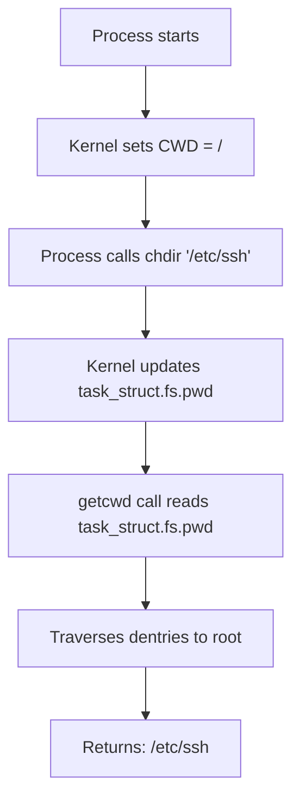

# `pwd` — Print Working Directory

## Overview

`pwd` prints the **absolute path** of the current working directory. Every process has a CWD (Current Working Directory) tracked by the kernel.

**Command type**: Shell builtin AND external (`/usr/bin/pwd`)  
**Location**: `/usr/bin/pwd`  
**Standard**: POSIX.1-2017

---

## Syntax

```bash
pwd [OPTION]
```

---

## Options

| Option | Description |
|--------|-------------|
| `-L` | Print logical path — use `$PWD` (may include symlinks, default) |
| `-P` | Print physical path — resolve all symlinks |
| `--help` | Display help |
| `--version` | Display version |

---

## Examples

### Basic Usage

```bash
# Print current directory
pwd
# /home/pruthvi/projects

# Navigate somewhere and check
cd /var/log
pwd
# /var/log
```

### Logical vs Physical Path

```bash
# If /var/run is a symlink to /run:
ls -la /var | grep run
# lrwxrwxrwx 1 root root 6 Jan  1 00:00 run -> ../run

cd /var/run

pwd -L     # /var/run   (logical — shows the symlink path)
pwd -P     # /run       (physical — resolved canonical path)
```

### In Scripts

```bash
#!/bin/bash
# Always capture the script's directory
SCRIPT_DIR="$(cd "$(dirname "${BASH_SOURCE[0]}")" && pwd)"
echo "Script lives in: $SCRIPT_DIR"
```

### Use $PWD Instead

The shell variable `$PWD` always holds the current directory and is faster to access than running the external `pwd` binary:

```bash
echo "$PWD"           # Same as pwd -L
echo "$(pwd)"         # Spawns subshell — slower
```

---

## Internal Working

### Builtin vs External

```bash
# Shell builtin — reads $PWD (fast, no fork)
pwd

# External binary — calls getcwd() syscall
/usr/bin/pwd
```

The shell builtin reads the `$PWD` environment variable set by the shell after each `cd`. The external `/usr/bin/pwd` uses the `getcwd()` system call, which traverses from the current inode up to the root to build the absolute path.

### Kernel Tracking of CWD



Every process has a `cwd` field in its `struct fs_struct` in the kernel. The `getcwd()` system call walks the VFS dentry tree from the current working directory up to the root, assembling the full path string.

---

## Practical Tips

!!! tip "Use `$PWD` in scripts instead of `$(pwd)`"
    Calling `$(pwd)` spawns a subshell, which is slower. Use the shell variable `$PWD` directly whenever possible.

!!! tip "Capture script directory reliably"
    ```bash
    SCRIPT_DIR="$(cd "$(dirname "${BASH_SOURCE[0]}")" && pwd -P)"
    ```
    This is the gold standard for finding a script's own directory, even when called via a symlink.

---

## Interview Questions

??? question "What is the difference between `pwd -L` and `pwd -P`?"
    `-L` (logical) prints the value of the shell's `$PWD` variable, which may contain symlink components. `-P` (physical) calls `getcwd()` which resolves all symlinks and returns the true canonical path. For example, if `/var/run` is a symlink to `/run`, then `pwd -L` shows `/var/run` and `pwd -P` shows `/run`.

??? question "Why does every process have a current working directory?"
    The CWD is used to resolve relative paths. When a process opens a file like `./config.yaml`, the kernel prepends the process's CWD to make it absolute. This is stored in the kernel's `task_struct` for each process and inherited by child processes.

??? question "Can two processes have different current working directories?"
    Yes — each process has its own CWD stored in the kernel. When a shell runs `cd`, it changes only the shell process's CWD. All other processes are unaffected. Child processes inherit the parent's CWD at fork time, but can change it independently thereafter.

---

## Related Commands

| Command | Description |
|---------|-------------|
| `cd` | Change current directory |
| `ls` | List directory contents |
| `realpath` | Print resolved absolute path of a file |
| `dirname` | Extract directory component from path |
| `basename` | Extract filename component from path |
