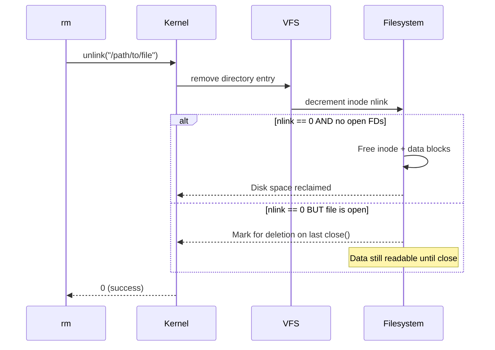

# `rm` — Remove Files and Directories

!!! tip "Quick Start / TL;DR Cheat Sheet"
    - **`rm file.txt`** — Permanently delete a file
    - **`rm -i file.txt`** — Safe delete: asks for confirmation before deleting
    - **`rm -r folder/`** — Delete a folder and all files inside it
    - **`rm -f file.txt`** — Force delete (no warning if file doesn't exist)
    - **`rm -rf folder/`** — Force delete a folder and all contents (Use with care!)

## Overview

The `rm` (Remove) command is used to delete files and folders permanently. Unlike Windows or macOS, Linux does **not** move deleted files to a Trash bin by default.

---

## Syntax

```bash
rm [OPTION]... FILE...
```

---

## Options Reference

| Option | Long Form | Description |
|--------|-----------|-------------|
| `-f` | `--force` | Ignore non-existent files, never prompt |
| `-i` | `--interactive=always` | Prompt before every removal |
| `-I` | `--interactive=once` | Prompt once before removing > 3 files or recursively |
| `-r` / `-R` | `--recursive` | Remove directories and their contents recursively |
| `-d` | `--dir` | Remove empty directories |
| `-v` | `--verbose` | Print each file as it is removed |
| `--preserve-root` | | Do not remove `/` (default, safety guard) |
| `--no-preserve-root` | | Disable the `/` safety guard (dangerous!) |

---

## Examples

### Remove Files

```bash
# Remove a single file
rm file.txt

# Remove multiple files
rm file1.txt file2.txt file3.txt

# Remove with glob
rm *.log

# Force remove (no error if not found)
rm -f missing_file.txt
```

### Remove Directories

```bash
# Remove empty directory
rm -d emptydir/

# Remove directory and all contents
rm -r mydir/

# Force remove recursively (no prompts)
rm -rf /tmp/old-build/
```

### Interactive Removal

```bash
# Prompt before each file
rm -i *.conf

# Prompt once (when removing more than 3 files or recursively)
rm -I -r /tmp/testdir/
```

### Verbose Removal

```bash
rm -rv /tmp/old-project/
# removed '/tmp/old-project/src/main.c'
# removed '/tmp/old-project/src/'
# removed '/tmp/old-project/'
```

### Handling Unusual Filenames

```bash
# File starting with a dash (prevent flag interpretation)
rm -- -oddfile.txt

# File with spaces
rm "file with spaces.txt"
rm 'another file.txt'

# File with newlines or special chars — use find
find . -name "*.tmp" -delete
```

---

## Internal Working

### How Deletion Works

`rm` does **not** erase data from disk. It calls `unlink()` on the file, which:

1. Removes the directory entry pointing to the inode
2. Decrements the inode's **hard link count**
3. If the link count reaches **0** AND no process has the file open → the kernel **frees the inode and data blocks**
4. If a process still has the file open, the data remains accessible until all file descriptors are closed



### Key System Calls

| System Call | Purpose |
|-------------|---------|
| `unlink()` | Remove a file's directory entry |
| `rmdir()` | Remove an empty directory entry |
| `openat()` | Traverse directories (for `-r`) |
| `getdents64()` | Read directory contents (for `-r`) |

### Why `rm -rf /` Is Dangerous

Without `--no-preserve-root`, GNU `rm` refuses to recursively remove `/`:

```bash
rm -rf /          # Error: it is dangerous to operate on '/'
rm -rf --no-preserve-root /   # Destroys the entire system!
```

---

## Recovering Deleted Files

!!! warning "Data is not wiped immediately"
    When you `rm` a file, the data blocks are marked free but not zeroed. Recovery tools can scan for them:
    ```bash
    # Check if file is still open (space not reclaimed yet)
    lsof | grep deleted

    # If open: recover via /proc/PID/fd/
    cp /proc/$(lsof | grep deleted | awk '{print $2}' | head -1)/fd/N /recovered

    # Filesystem-specific recovery tools
    extundelete /dev/sda1 --restore-all    # ext3/ext4
    testdisk                                # interactive recovery
    ```

!!! danger "Secure deletion"
    To truly wipe data from a traditional spinning disk:
    ```bash
    shred -u -n 3 sensitive.txt    # overwrite 3 times then delete
    ```
    Note: This is ineffective on SSDs (due to wear leveling) and filesystems with journaling. Use full-disk encryption instead.

---

## Performance Notes

!!! tip "Deleting millions of files"
    `rm -rf dir/` with millions of files can be slow because `rm` reads each filename via `getdents64()` then calls `unlink()` per file. Faster alternatives:
    ```bash
    # Fastest: create empty dir and rsync
    mkdir /tmp/empty
    rsync -a --delete /tmp/empty/ /path/to/bigdir/
    rmdir /path/to/bigdir

    # Or use find (parallel possible with -exec +)
    find /path/to/bigdir -type f -delete
    ```

---

## Common Mistakes

!!! danger "Removing the wrong directory"
    ```bash
    # BAD: missing quote → removes current dir and then /important
    rm -rf $MYDIR /important

    # GOOD: quote variables
    rm -rf "$MYDIR"

    # BETTER: always verify the path first
    echo "$MYDIR"
    rm -rf "$MYDIR"
    ```

!!! warning "Shell glob expansion"
    ```bash
    # If *.txt matches nothing, bash expands it literally
    # Use: shopt -s nullglob first
    shopt -s nullglob
    rm *.txt    # safe — does nothing if no files match
    ```

---

## Interview Questions

??? question "Does `rm` erase data from disk?"
    No. `rm` calls `unlink()`, which removes the file's directory entry and decrements the inode's link count. If the count drops to zero and no process has the file open, the kernel marks the inode and data blocks as free — but does not zero them. The data remains on disk until those blocks are overwritten by new files.

??? question "A log file is growing and taking up space, but `rm` says it's deleted. Why is disk space not freed?"
    Because a process (like a logging daemon) still has the file open. `unlink()` removed the directory entry, but the kernel keeps the inode and data blocks alive as long as there's an open file descriptor. Check with `lsof | grep deleted`. Solutions: restart the process that has it open, or truncate the file while it's open: `> /var/log/app.log`.

??? question "What is the difference between `rm -r` and `rmdir`?"
    `rmdir` only removes **empty** directories and fails on non-empty ones. `rm -r` removes a directory and **all of its contents** recursively. `rmdir` is safer for automation when you expect directories to be empty.

---

## Related Commands

| Command | Description |
|---------|-------------|
| `rmdir` | Remove empty directories only |
| `mv` | Move files (alternative to deleting) |
| `find -delete` | Delete files matching search criteria |
| `shred` | Securely overwrite and delete files |
| `trash-cli` | Move files to trash instead of permanent deletion |
