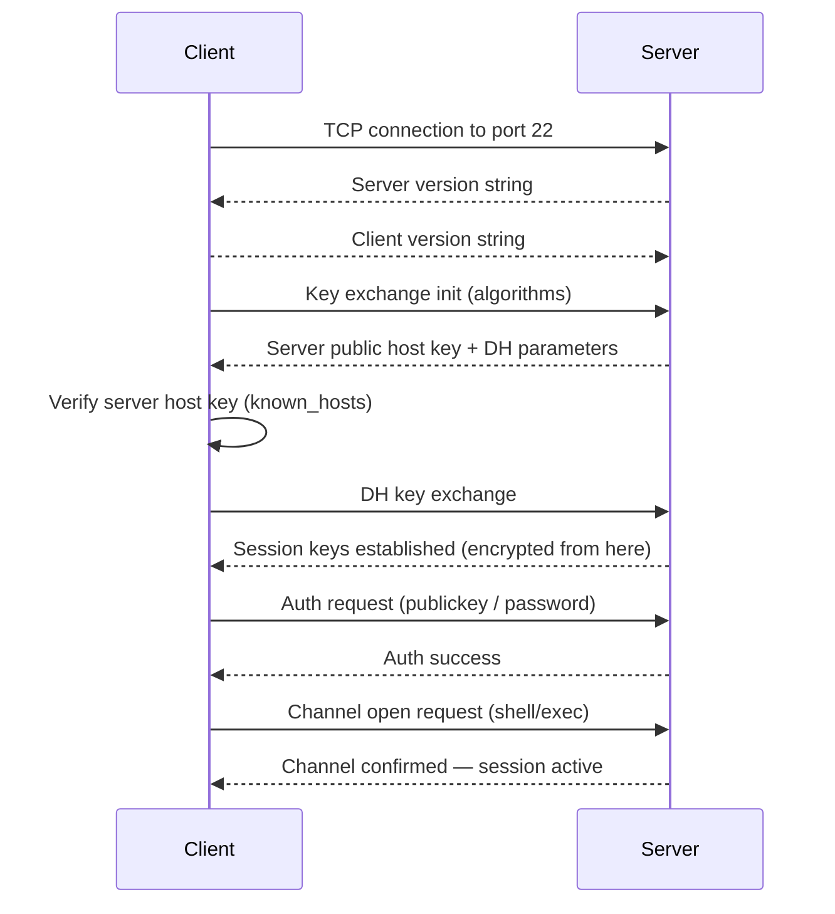

# `ssh` — Secure Shell

## Overview

`ssh` opens an encrypted remote shell session to another Linux machine. It authenticates the user, encrypts all traffic, and can also forward ports, proxy traffic, and transfer files. It is the standard protocol for remote server administration.

**Command type**: External (OpenSSH)  
**Location**: `/usr/bin/ssh`  
**Protocol**: SSHv2 (RFC 4251–4256)

---

## Syntax

```bash
ssh [OPTIONS] [user@]hostname [command]
```

---

## Options Reference

| Option | Description |
|--------|-------------|
| `-p PORT` | Connect to non-standard port (default: 22) |
| `-i FILE` | Identity file (private key) to use |
| `-l USER` | Login username |
| `-v` | Verbose — debug connection issues |
| `-vvv` | Maximum verbosity |
| `-L local:host:remote` | Local port forwarding |
| `-R remote:host:local` | Remote port forwarding |
| `-D PORT` | Dynamic port forwarding (SOCKS proxy) |
| `-N` | Do not execute a remote command (for tunnels) |
| `-f` | Go to background before executing command |
| `-T` | Disable pseudo-terminal allocation |
| `-A` | Forward SSH agent |
| `-X` | Enable X11 forwarding |
| `-o OPTION` | Set config option directly |

---

## Examples

### Basic Connection

```bash
# Connect as current user
ssh 192.168.1.10

# Connect as specific user
ssh pruthvi@192.168.1.10
ssh -l pruthvi 192.168.1.10

# Connect on non-standard port
ssh -p 2222 pruthvi@192.168.1.10
```

### Run a Single Command

```bash
# Run command without interactive shell
ssh user@server "df -h"
ssh user@server "systemctl status nginx"

# Run multiple commands
ssh user@server "uptime && free -h && df -h"

# Run as root via sudo
ssh user@server "sudo systemctl restart nginx"
```

### Key-Based Authentication

```bash
# Generate an SSH key pair (ed25519 is preferred)
ssh-keygen -t ed25519 -C "pruthvi@work"

# Copy public key to remote server
ssh-copy-id user@server
# Or manually:
cat ~/.ssh/id_ed25519.pub | ssh user@server "mkdir -p ~/.ssh && cat >> ~/.ssh/authorized_keys"

# Connect using a specific key
ssh -i ~/.ssh/my_key user@server
```

### Port Forwarding (Tunnels)

```bash
# Local forwarding: access remote service locally
# Access remote MySQL (3306) at localhost:3307
ssh -L 3307:localhost:3306 user@server -N

# Remote forwarding: expose local service on remote server
# Expose local port 8080 on remote server's port 80
ssh -R 80:localhost:8080 user@server -N

# Dynamic forwarding: SOCKS5 proxy
ssh -D 1080 user@server -N
# Then configure browser to use SOCKS5 proxy at localhost:1080
```

### Jump Hosts (Bastion)

```bash
# Connect through a bastion/jump host
ssh -J user@bastion user@internal-server

# Multi-hop
ssh -J user@bastion1,user@bastion2 user@final-server
```

### SSH Config File (~/.ssh/config)

The config file lets you set shortcuts and persistent options:

```
# ~/.ssh/config

Host myserver
    HostName 192.168.1.10
    User pruthvi
    Port 2222
    IdentityFile ~/.ssh/id_ed25519
    ServerAliveInterval 60

Host bastion
    HostName bastion.example.com
    User admin
    IdentityFile ~/.ssh/bastion_key

Host internal
    HostName 10.0.0.50
    User deploy
    ProxyJump bastion
```

```bash
# Now simply:
ssh myserver        # uses all config above
ssh internal        # automatically jumps through bastion
```

---

## How SSH Works (Internals)



---

## Security Best Practices

!!! tip "Use Ed25519 keys"
    ```bash
    ssh-keygen -t ed25519 -C "description"
    ```
    Ed25519 is faster and more secure than the older RSA 2048-bit standard.

!!! warning "Disable password authentication on servers"
    Once key-based auth is set up, disable passwords in `/etc/ssh/sshd_config`:
    ```
    PasswordAuthentication no
    PubkeyAuthentication yes
    PermitRootLogin no
    ```

!!! danger "Always verify host fingerprints"
    The first time you connect, SSH shows the server's fingerprint. Verify it out-of-band (from the cloud console or server admin). Man-in-the-middle attacks rely on users accepting unknown fingerprints.

---

## Interview Questions

??? question "What is the difference between password and key-based SSH authentication?"
    **Password auth**: you type a password that is sent (encrypted) to the server, which checks it against `/etc/shadow`. Susceptible to brute force. **Key-based auth**: the client proves possession of a private key by signing a challenge with it. The server verifies the signature against the public key in `~/.ssh/authorized_keys`. No secret is ever transmitted — only a signature. Key-based auth is significantly more secure and is the recommended method.

??? question "What is SSH port forwarding and when would you use it?"
    SSH port forwarding creates an encrypted tunnel through the SSH connection. **Local forwarding** (`-L`) makes a remote service accessible on a local port — e.g., accessing a remote database without opening its port to the internet. **Remote forwarding** (`-R`) exposes a local service on the remote server. **Dynamic forwarding** (`-D`) creates a SOCKS proxy, routing all traffic through the SSH server.

??? question "What is a jump host / bastion host?"
    A bastion (jump) host is a hardened server that is the only one with a public SSH port exposed. All other servers are on a private network. To reach them, you SSH into the bastion first, then SSH again from there. The `-J` flag automates this in a single command: `ssh -J bastion internal-server`, which handles the two-hop connection transparently.

---

## Related Commands

| Command | Description |
|---------|-------------|
| `scp` | Copy files over SSH |
| `rsync` | Sync files over SSH efficiently |
| `sftp` | Interactive file transfer over SSH |
| `ssh-keygen` | Generate and manage SSH keys |
| `ssh-copy-id` | Install public key on remote server |
| `ssh-agent` | Hold decrypted keys in memory |
