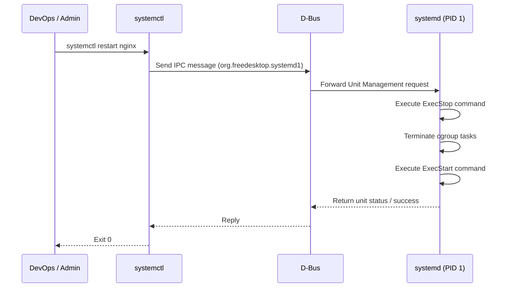

# `systemctl` — Systemd Control

## Overview

`systemctl` is the primary utility used to inspect and control the `systemd` init system and service manager. It manages services (daemons), mount points, sockets, timers, and target runlevels.

**Command type**: External (systemd)  
**Location**: `/usr/bin/systemctl`

---

## Syntax

```bash
systemctl [OPTIONS] COMMAND [UNIT...]
```

---

## Essential Service Commands

| Command | Description |
|---------|-------------|
| `systemctl start UNIT` | Start (activate) a service immediately |
| `systemctl stop UNIT` | Stop (deactivate) a service immediately |
| `systemctl restart UNIT` | Stop then start a service |
| `systemctl reload UNIT` | Reload service configuration without stopping it |
| `systemctl status UNIT` | Show runtime status, PID, memory usage, and recent logs |
| `systemctl enable UNIT` | Enable service to start automatically at boot |
| `systemctl disable UNIT` | Prevent service from starting automatically at boot |
| `systemctl enable --now UNIT` | Enable AND start a service in one command |
| `systemctl disable --now UNIT` | Disable AND stop a service in one command |
| `systemctl is-active UNIT` | Check if service is currently running (returns 0 if active) |
| `systemctl is-enabled UNIT` | Check if service is enabled at boot |

---

## Examples

### Checking Service Status

```bash
systemctl status nginx
```

Sample Output:
```
* nginx.service - A high performance web server and a reverse proxy server
     Loaded: loaded (/lib/systemd/system/nginx.service; enabled; vendor preset: enabled)
     Active: active (running) since Tue 2026-07-28 10:00:00 UTC; 2h 15min ago
       Docs: man:nginx(8)
   Main PID: 1234 (nginx)
      Tasks: 3 (limit: 4915)
     Memory: 12.4M
        CPU: 150ms
     CGroup: /system.slice/nginx.service
             |-1234 "nginx: master process /usr/sbin/nginx"
             |-1235 "nginx: worker process"
             `-1236 "nginx: worker process"
```

### Managing Service Lifecycle

```bash
# Start and enable Docker
systemctl enable --now docker

# Gracefully reload configuration (e.g. Nginx, SSH)
systemctl reload nginx

# Mask a unit (prevents starting manually or by other services)
systemctl mask bluetooth.service

# Unmask a unit
systemctl unmask bluetooth.service
```

### Listing Units

```bash
# List all active services
systemctl list-units --type=service

# List all failed units (troubleshooting starting point)
systemctl --failed

# List all installed unit files and their enabled status
systemctl list-unit-files --type=service
```

### Target States (Runlevels)

```bash
# View current default target (e.g. multi-user.target or graphical.target)
systemctl get-default

# Set default target to CLI mode (multi-user)
systemctl set-default multi-user.target

# Change state immediately without rebooting
systemctl isolate multi-user.target
```

### System Power State

```bash
systemctl reboot      # Reboot the system
systemctl poweroff    # Shut down and power off
```

---

## How systemctl Works (Internals)



---

## Interview Questions

??? question "What is the difference between `systemctl enable` and `systemctl start`?"
    `systemctl start` immediately runs the service in the current session without affecting boot behavior. `systemctl enable` creates symlinks in `/etc/systemd/system/` so the service starts automatically during system boot, but does not start it in the current session. Use `systemctl enable --now` to do both.

??? question "What does masking a service (`systemctl mask`) do?"
    Masking links the service unit file to `/dev/null`. This completely blocks the service from starting, preventing it from being started manually or automatically as a dependency of another service.

---

## Related Commands

| Command | Description |
|---------|-------------|
| `journalctl` | Query systemd logs for units |
| `service` | Legacy SysVinit wrapper (redirects to systemctl) |
| `chkconfig` | Legacy SysVinit boot manager |
