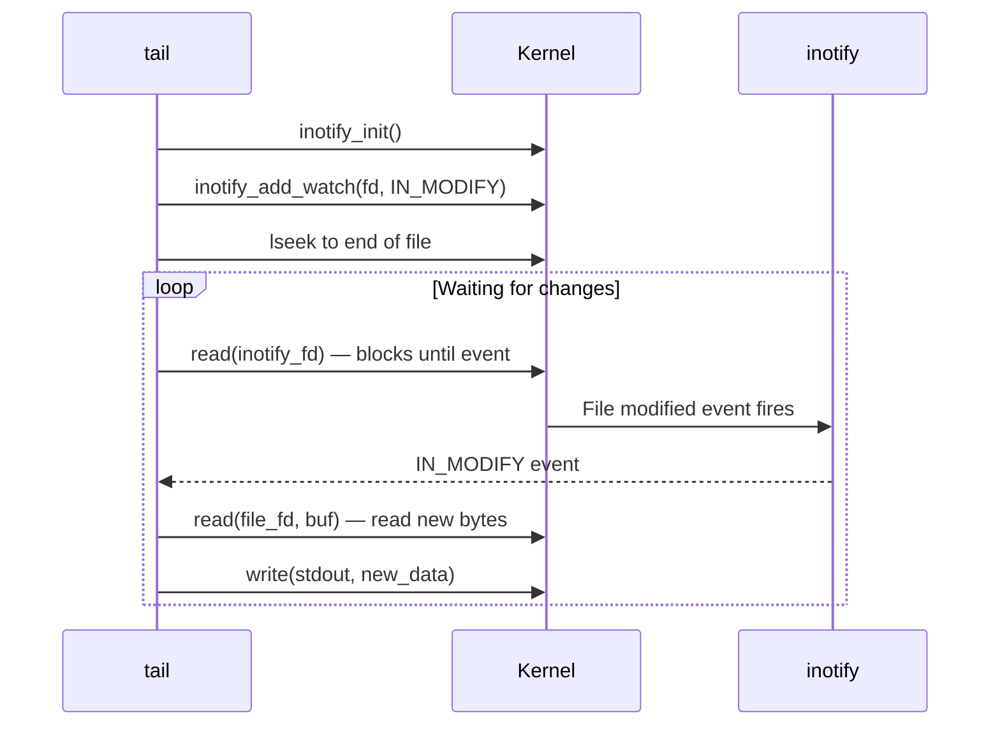

# `tail` — View Last Lines of a File

## Overview

`tail` prints the **last N lines** (or bytes) of a file. Its killer feature is `-f` — **follow mode** — which watches a file and prints new lines as they are appended. This makes `tail -f` the standard tool for monitoring live logs.

**Command type**: External (GNU coreutils)  
**Location**: `/usr/bin/tail`  
**Standard**: POSIX.1-2017

---

## Syntax

```bash
tail [OPTION]... [FILE]...
```

---

## Options Reference

| Option | Long Form | Description |
|--------|-----------|-------------|
| `-n N` | `--lines=N` | Print last N lines (default: 10) |
| `-c N` | `--bytes=N` | Print last N bytes |
| `-f` | `--follow` | Follow file growth — print new lines as they are appended |
| `-F` | | Like `-f` but retries if the file is replaced (log rotation aware) |
| `--pid=PID` | | With `-f`, exit when process PID terminates |
| `-q` | `--quiet` | Never print file headers |
| `-v` | `--verbose` | Always print file headers |
| `-s N` | `--sleep-interval=N` | With `-f`, sleep N seconds between checks (default: 1) |
| `-z` | `--zero-terminated` | Line delimiter is NUL, not newline |

---

## Examples

### Basic Usage

```bash
# Show last 10 lines (default)
tail /var/log/syslog

# Show last 50 lines
tail -n 50 /var/log/nginx/access.log

# Show last 5 lines
tail -5 /etc/passwd
```

### Skip First N Lines

```bash
# Print everything EXCEPT the first 5 lines
# (positive +N syntax: start from line N)
tail -n +5 file.txt

# Skip the header line of a CSV
tail -n +2 data.csv | cut -d, -f1,3
```

### Follow Live Logs

```bash
# Watch a log file in real time
tail -f /var/log/syslog

# Follow multiple files at once (shows filename headers)
tail -f /var/log/nginx/access.log /var/log/nginx/error.log

# Follow and exit when a process terminates
tail -f app.log --pid=$(pgrep myapp)
```

### Log Rotation Aware Follow

```bash
# -F retries if the file is deleted/recreated (e.g., by logrotate)
tail -F /var/log/nginx/access.log
```

### Last N Bytes

```bash
# Show last 500 bytes
tail -c 500 file.txt

# Show last 1 MB
tail -c 1M largefile.log
```

### Use in Pipelines

```bash
# Watch only error lines in real time
tail -f /var/log/syslog | grep --line-buffered "error"

# Show last 20 lines of a compressed file
zcat file.log.gz | tail -20

# Monitor last 10 entries of auth log, highlight failed logins
tail -f /var/log/auth.log | grep --color=always -i "failed"
```

---

## How `tail -f` Works (Internals)

In follow mode, `tail` uses `inotify` (Linux kernel file event notification) to efficiently watch for file changes without busy-polling:



Without `inotify` (e.g., on NFS or some filesystems), `tail -f` falls back to polling every second (`-s 1`).

---

## Practical Monitoring Patterns

```bash
# Pattern 1: Monitor application startup
tail -f /var/log/app/startup.log | grep -m1 "Server started"
# Stops once the pattern is found

# Pattern 2: Live error dashboard
tail -f /var/log/app/*.log | grep --color=always -E "ERROR|WARN|CRIT"

# Pattern 3: Count errors per minute
tail -f app.log | awk '/ERROR/{count++} NR%60==0{print count; count=0}'

# Pattern 4: Follow log, auto-stop after process dies
APP_PID=$(pgrep myapp)
tail -f app.log --pid=$APP_PID
```

---

## Interview Questions

??? question "What is the difference between `tail -f` and `tail -F`?"
    Both follow file growth, but `-F` additionally handles log rotation. When a file is deleted and recreated (e.g., by `logrotate`), `-f` stops because it's watching the original inode which no longer exists. `-F` detects this and reopens the file by name, continuing to follow the new file. Always use `-F` when monitoring production logs.

??? question "What does `tail -n +5` do?"
    The `+N` syntax means "start from line N". So `tail -n +5` prints everything from line 5 to the end of the file — effectively skipping the first 4 lines. This is the standard way to skip a header row when processing CSV files or command output.

??? question "How does `tail -f` know when new data is added without constantly reading the file?"
    On Linux, `tail -f` uses the `inotify` kernel subsystem to register for `IN_MODIFY` events on the file. When the kernel notifies it of a write, `tail` reads the new bytes. This is event-driven and uses no CPU while waiting, unlike polling. On filesystems that don't support `inotify` (e.g., NFS), it falls back to polling every second.

---

## Related Commands

| Command | Description |
|---------|-------------|
| `head` | View first N lines of a file |
| `less +F` | Follow mode inside the `less` pager |
| `journalctl -f` | Follow systemd journal logs |
| `multitail` | Multi-file tail with colour and filtering |
| `lnav` | Log file navigator — advanced log viewer |
