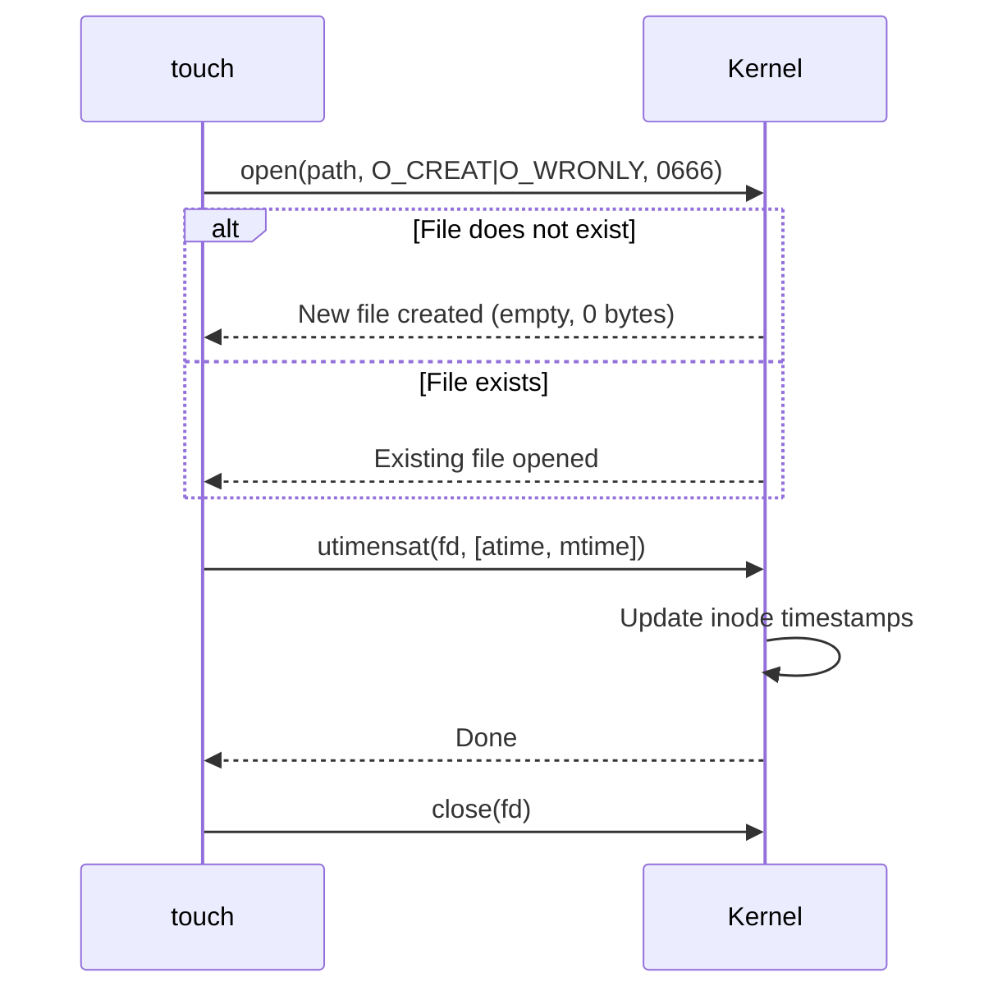

# `touch` — Create Files / Update Timestamps

## Overview

`touch` has two primary uses:
1. **Create an empty file** if it does not exist
2. **Update timestamps** (access time and/or modification time) of an existing file

**Command type**: External (GNU coreutils)  
**Location**: `/usr/bin/touch`  
**Standard**: POSIX.1-2017

---

## Syntax

```bash
touch [OPTION]... FILE...
```

---

## Options Reference

| Option | Long Form | Description |
|--------|-----------|-------------|
| `-a` | | Change only the access time |
| `-m` | | Change only the modification time |
| `-c` | `--no-create` | Do not create the file if it does not exist |
| `-t STAMP` | | Use timestamp in format `[[CC]YY]MMDDhhmm[.ss]` |
| `-d STRING` | `--date=STRING` | Use a human-readable date string |
| `-r FILE` | `--reference=FILE` | Use reference file's timestamps instead |

---

## Examples

### Create Empty Files

```bash
# Create a single empty file
touch newfile.txt

# Create multiple files at once
touch file1.txt file2.txt file3.txt

# Create files with brace expansion
touch test_{a,b,c}.log
```

### Update Timestamps

```bash
# Update both atime and mtime to now
touch existing.txt

# Update only access time
touch -a existing.txt

# Update only modification time
touch -m existing.txt
```

### Set a Specific Timestamp

```bash
# Set to a specific date/time (Jan 15, 2025 09:30)
touch -t 202501150930 file.txt

# Use a human-readable date string
touch -d "2025-01-15 09:30:00" file.txt
touch -d "yesterday" file.txt
touch -d "2 hours ago" file.txt
touch -d "next Monday" file.txt
```

### Copy Timestamps from Another File

```bash
# Give file.txt the same timestamps as reference.txt
touch -r reference.txt file.txt
```

### Do Not Create if Missing

```bash
# Update timestamps only if the file already exists
touch -c maybe-exists.txt
```

---

## File Timestamps Explained

Every file has three timestamps stored in its inode:

| Timestamp | Name | Updated When |
|-----------|------|-------------|
| `atime` | Access time | File is read |
| `mtime` | Modification time | File content is written |
| `ctime` | Change time | Inode metadata changes (permissions, owner, mtime) |

```bash
# View all three timestamps
stat file.txt
# Access: 2025-01-15 09:30:00.000000000
# Modify: 2025-01-14 22:00:00.000000000
# Change: 2025-01-14 22:00:00.000000000

# ls -l shows mtime
ls -l file.txt

# ls -lu shows atime
ls -lu file.txt

# ls -lc shows ctime
ls -lc file.txt
```

!!! note "ctime cannot be set manually"
    You cannot set `ctime` with `touch` or any other user-space tool. `ctime` is always set by the kernel to the current time whenever an inode change occurs. Only root can manipulate it via direct filesystem tools.

---

## How `touch` Works (Internals)



When creating a new file, `touch` uses `open()` with `O_CREAT`. The file permissions are `0666 & ~umask` (typically `0644`).

When updating timestamps, `touch` calls `utimensat()`, which sets the `atime` and `mtime` fields in the inode directly.

---

## Common Uses in Practice

### Makefile Dependency Tracking

`make` uses `mtime` to determine whether a file needs rebuilding. `touch` is often used to force a rebuild:

```bash
touch src/main.c   # Forces make to recompile this file
```

### Create a Lock File

```bash
LOCKFILE=/tmp/myscript.lock
if [ -f "$LOCKFILE" ]; then
    echo "Script already running"
    exit 1
fi
touch "$LOCKFILE"
trap "rm -f $LOCKFILE" EXIT
```

### Batch File Creation for Testing

```bash
# Create 100 test files
for i in $(seq -w 1 100); do touch "test_${i}.dat"; done
```

---

## Interview Questions

??? question "What are the three timestamps on a Linux file and which ones can touch modify?"
    Every file has **atime** (last access), **mtime** (last content modification), and **ctime** (last inode change). `touch` can modify `atime` and `mtime`. `ctime` is automatically updated by the kernel whenever `atime` or `mtime` changes and cannot be set manually by any user-space tool.

??? question "If `touch file.txt` is run on an existing file, what changes?"
    Both `atime` and `mtime` are updated to the current time. The file content and size remain unchanged. `ctime` is also updated because the inode metadata changed.

??? question "Why is `touch` used in Makefiles?"
    `make` rebuilds targets when source files are newer than the output. By `touch`-ing a source file, you update its `mtime` to now, making it appear newer than the compiled output and forcing `make` to recompile it — without actually changing the file content.

---

## Related Commands

| Command | Description |
|---------|-------------|
| `stat` | Display full file metadata including all timestamps |
| `ls -l` | Show modification time |
| `ls -lu` | Show access time |
| `date` | Display or set system date and time |
| `find -newer` | Find files newer than a reference file |
