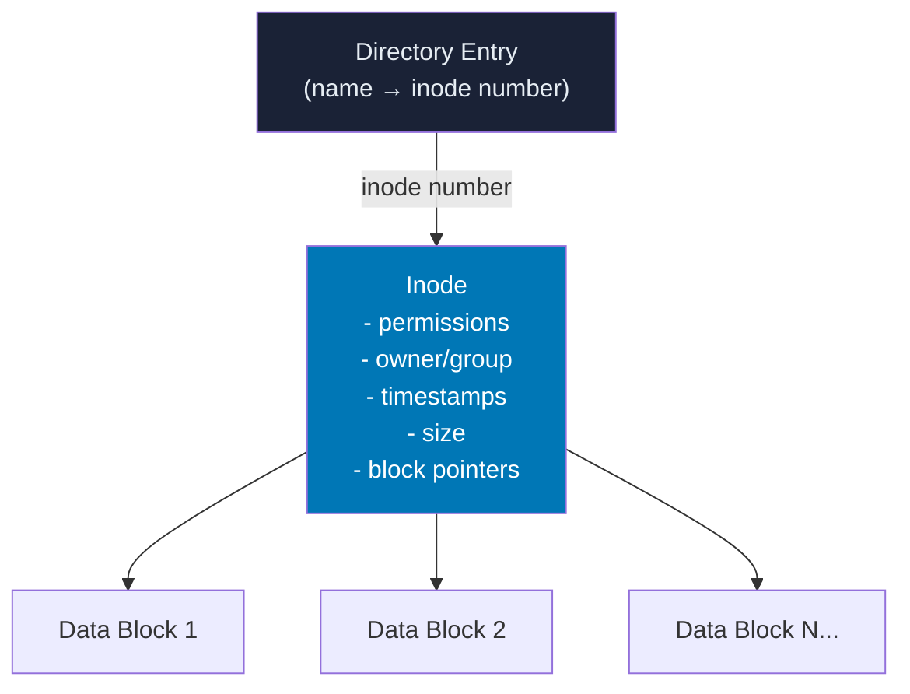
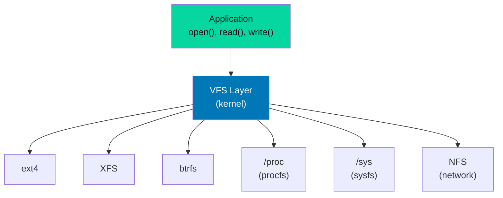

# Linux Filesystem

## Overview

The Linux filesystem is the organized structure that manages how data is stored, retrieved, and organized on storage devices. Understanding the filesystem means understanding where Linux keeps everything — and why.

## Filesystem Hierarchy Standard (FHS)

<file-tree>
/
├── bin/        → Essential user binaries (ls, cp, mv)
├── boot/       → Bootloader files, kernel, initramfs
├── dev/        → Device files (block, char, pseudo)
├── etc/        → System-wide configuration files
├── home/       → User home directories
├── lib/        → Shared libraries for /bin and /sbin
├── lib64/      → 64-bit shared libraries
├── media/      → Removable media mount points
├── mnt/        → Temporary mount points
├── opt/        → Optional third-party software
├── proc/       → Virtual FS: process & kernel info
├── root/       → root user's home directory
├── run/        → Runtime data (PIDs, sockets)
├── sbin/       → System administration binaries
├── srv/        → Data for services (web, ftp)
├── sys/        → Virtual FS: kernel objects (sysfs)
├── tmp/        → Temporary files (cleared on boot)
├── usr/        → Secondary hierarchy (user programs)
│   ├── bin/    → Non-essential user binaries
│   ├── lib/    → Libraries for /usr/bin
│   ├── local/  → Locally compiled software
│   └── share/  → Architecture-independent data
└── var/        → Variable data (logs, spools, caches)
    ├── log/    → Log files
    ├── mail/   → Mailboxes
    ├── run/    → (legacy) runtime data
    └── spool/  → Print and mail queues
</file-tree>

## Inodes

Every file in a Linux filesystem is represented by an **inode** (index node) — a data structure that stores all metadata about a file **except its name**.



### What's in an Inode

| Field | Description |
|-------|-------------|
| `mode` | File type + permissions (rwxrwxrwx) |
| `uid` / `gid` | Owner user and group IDs |
| `nlinks` | Hard link count |
| `size` | File size in bytes |
| `atime` | Last access time |
| `mtime` | Last modification time |
| `ctime` | Last status change time |
| `blocks` | Number of 512-byte blocks allocated |
| `block[15]` | Pointers to data blocks (direct + indirect) |

!!! info "What is NOT in an inode?"
    The filename! Filenames live in **directory entries** (dentries), which map names to inode numbers. This is why hard links work — multiple names can point to the same inode.

## Hard Links vs Soft Links

=== "Hard Links"

    ```bash
    ln original.txt hardlink.txt
    ```

    - Both point to the **same inode**
    - Deleting one does not delete data (data removed when link count reaches 0)
    - Cannot span filesystems
    - Cannot link directories (usually)
    - Verified: `ls -li` shows same inode number

=== "Soft (Symbolic) Links"

    ```bash
    ln -s /path/to/original symlink.txt
    ```

    - Points to a **path** (not an inode)
    - Has its own inode (type `l`)
    - Can span filesystems and partitions
    - Can link directories
    - Breaks if target is moved or deleted

## VFS — Virtual Filesystem

The **VFS (Virtual File System)** is a kernel abstraction layer that provides a unified interface to different filesystem types.



## Permissions

<permission-calculator></permission-calculator>

<octal-converter></octal-converter>

### Understanding Permission Bits

```bash
ls -l /etc/shadow
```

```
-rw-r----- 1 root shadow 1423 Jan 15 09:22 /etc/shadow
```

| Characters | Meaning |
|-----------|---------|
| `-` | File type: regular file |
| `rw-` | Owner: read + write, no execute |
| `r--` | Group (`shadow`): read only |
| `---` | Others: no permissions |

## Special Permissions

| Bit | Octal | Name | Effect |
|-----|-------|------|--------|
| `s` on owner execute | `4000` | SUID | Executes as file owner |
| `s` on group execute | `2000` | SGID | Executes as file group |
| `t` on others execute | `1000` | Sticky | Only owner can delete (used on /tmp) |

```bash
# Check SUID files (potential security concern)
find / -perm -4000 -type f 2>/dev/null

# /tmp has sticky bit
ls -ld /tmp
# drwxrwxrwt 20 root root 4096 Jan 15 10:00 /tmp
```

## Interview Questions

??? question "What is the difference between a hard link and a symbolic link?"
    A **hard link** creates another directory entry pointing to the same inode. Both names are equal — there is no "original." A **symbolic link** creates a new inode containing a path string. If the target moves, the symlink breaks. Hard links cannot cross filesystems; symlinks can.

??? question "Can you create a hard link to a directory?"
    Generally no, for regular users and most filesystems. The kernel prevents it to avoid circular references in the directory tree (which would break `fsck`, `find`, and path resolution). Exceptions: `.` and `..` are hard links to directories created by the kernel.

??? question "What happens when you delete a file?"
    The kernel decrements the hard link count of the inode. When the count reaches 0 **and** no process has the file open, the data blocks are freed and the inode is marked available. If a process still has the file open, data remains until the last file descriptor is closed (used for log rotation: `logrotate` renames/deletes, but old daemon keeps writing to the old inode until HUP).
