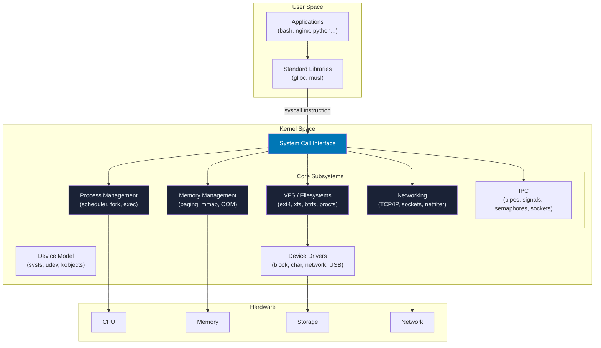
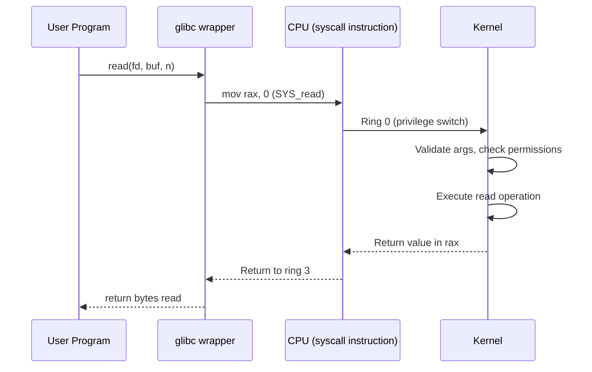

# Linux Kernel Architecture

## Overview

The Linux kernel is the core of the operating system — it manages hardware, provides abstractions for user programs, and enforces security boundaries. Understanding the kernel architecture is essential for any serious Linux engineer.

**Current stable**: Linux 6.x  
**Written in**: C (primarily), with some Assembly for architecture-specific code  
**License**: GNU GPL v2  
**Repository**: [kernel.org](https://www.kernel.org)

---

## High-Level Architecture



---

## System Calls

System calls are the **API between user space and the kernel**. When a program needs kernel services (reading a file, creating a process, allocating memory), it makes a system call.

### How a System Call Works



### Common System Calls

| Category | System Call | Description |
|----------|-------------|-------------|
| **Process** | `fork()` | Create child process |
| **Process** | `execve()` | Execute program |
| **Process** | `exit()` | Terminate process |
| **Process** | `wait4()` | Wait for child |
| **File** | `open()` / `openat()` | Open file |
| **File** | `read()` | Read from fd |
| **File** | `write()` | Write to fd |
| **File** | `close()` | Close fd |
| **File** | `stat()` / `lstat()` | Get file metadata |
| **Memory** | `mmap()` | Map memory region |
| **Memory** | `brk()` | Change heap size |
| **Memory** | `munmap()` | Unmap memory |
| **Network** | `socket()` | Create socket |
| **Network** | `bind()` | Bind socket to address |
| **Network** | `connect()` | Connect to remote |
| **Network** | `sendto()` / `recvfrom()` | Send/receive data |
| **IPC** | `kill()` | Send signal |
| **IPC** | `pipe()` | Create pipe |
| **IPC** | `futex()` | Fast userspace mutex |

```bash
# Trace all system calls made by a command
strace ls /tmp

# Count system calls
strace -c ls /tmp

# Trace a specific syscall
strace -e trace=open,read,write ls /tmp
```

---

## Kernel Modules

Kernel modules are pieces of code that can be loaded/unloaded into the kernel at runtime, without rebooting.

```bash
# List loaded modules
lsmod

# Load a module
sudo modprobe <module_name>

# Remove a module
sudo modprobe -r <module_name>

# Show module information
modinfo <module_name>

# Load at boot (add to /etc/modules-load.d/)
echo "br_netfilter" | sudo tee /etc/modules-load.d/br_netfilter.conf
```

---

## /proc — Process and Kernel Information

`/proc` is a **virtual filesystem** that exposes kernel and process information as files.

```bash
# CPU information
cat /proc/cpuinfo

# Memory information
cat /proc/meminfo

# Running processes
ls /proc/ | grep -E '^[0-9]+$'    # Each number is a PID

# Network connections
cat /proc/net/tcp

# Kernel version
cat /proc/version

# Kernel parameters (tunable)
cat /proc/sys/kernel/hostname
cat /proc/sys/net/ipv4/ip_forward

# Mounts
cat /proc/mounts
```

### Per-Process /proc Entries

```bash
# For PID 1 (systemd/init)
ls /proc/1/
```

| File | Content |
|------|---------|
| `/proc/PID/status` | Process status, memory, capabilities |
| `/proc/PID/maps` | Virtual memory map |
| `/proc/PID/fd/` | File descriptors (symlinks) |
| `/proc/PID/cmdline` | Command-line arguments |
| `/proc/PID/environ` | Environment variables |
| `/proc/PID/stat` | Process accounting stats |
| `/proc/PID/io` | I/O counters |
| `/proc/PID/net/` | Network info (if in own namespace) |

---

## /sys — Kernel Object Hierarchy (sysfs)

`/sys` exposes the **device model** — hardware devices, drivers, and kernel objects.

```bash
# CPU frequency scaling
cat /sys/devices/system/cpu/cpu0/cpufreq/scaling_governor

# Block device queues
ls /sys/block/sda/queue/

# Network interface settings
cat /sys/class/net/eth0/speed
cat /sys/class/net/eth0/operstate

# PCI devices
ls /sys/bus/pci/devices/
```

---

## Boot Sequence

<boot-sequence></boot-sequence>

---

## Kernel Tuning with sysctl

```bash
# View all kernel parameters
sysctl -a

# Common performance tuning
sudo sysctl -w net.ipv4.tcp_max_syn_backlog=4096
sudo sysctl -w vm.swappiness=10
sudo sysctl -w kernel.pid_max=4194304

# Persist in /etc/sysctl.d/
cat /etc/sysctl.d/99-custom.conf
```

---

## Interview Questions

??? question "What is the difference between kernel space and user space?"
    The CPU runs in two privilege levels. **Kernel space** runs at ring 0 (highest privilege) with unrestricted access to all hardware and memory. **User space** runs at ring 3 (lowest privilege) — programs cannot directly access hardware. The boundary is enforced by the MMU and CPU privilege levels. Crossing this boundary happens via system calls.

??? question "What happens when a process calls `malloc()`?"
    `malloc()` is a C library function, not a syscall. It manages a **heap** in user space. On first allocation, it calls `brk()` or `mmap()` (syscalls) to ask the kernel for memory. Subsequent `malloc()` calls are usually satisfied from the user-space heap without syscalls. When the heap is exhausted, glibc calls `brk()` again to grow it.

??? question "What is a kernel panic?"
    A kernel panic is an unrecoverable error detected by the kernel — similar to a BSOD on Windows. Common causes: null pointer dereference in kernel code, stack overflow, hardware failure. The kernel halts execution and (optionally) writes a crash dump (kdump). Analyzed with `crash` tool against vmcore dump.
