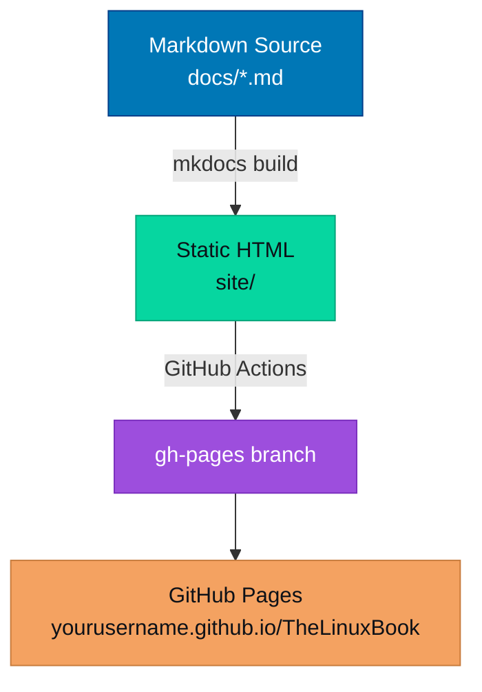

  <h1>TheLinuxBook</h1>
  

    A professional Linux documentation reference built for engineers. 
    From shell basics to kernel internals — everything in one place.
  

  

    MkDocs + Material
    Linux Fundamentals → Advanced
    Kernel Internals
    Hands-on Labs
    Interview Prep
  

## What's Inside

  <a class="tlb-card" href="fundamentals/">
    Fundamentals
    Core commands, filesystem hierarchy, kernel concepts, and system architecture.
  </a>
  <a class="tlb-card" href="shell/bash/">
    Shell & Scripting
    Bash scripting, shell internals, job control, process substitution, and more.
  </a>
  <a class="tlb-card" href="process/">
    Process Management
    Process lifecycle, signals, scheduling, namespaces, and cgroups.
  </a>
  <a class="tlb-card" href="memory/">
    Memory Management
    Virtual memory, paging, mmap, huge pages, OOM killer, and NUMA.
  </a>
  <a class="tlb-card" href="networking/">
    Networking
    TCP/IP stack, sockets, iptables, network namespaces, and troubleshooting.
  </a>
  <a class="tlb-card" href="storage/">
    Storage
    Block devices, filesystems, LVM, RAID, I/O schedulers, and NFS.
  </a>
  <a class="tlb-card" href="security/">
    Security
    Permissions, SELinux, AppArmor, capabilities, seccomp, and audit.
  </a>
  <a class="tlb-card" href="containers/">
    Containers
    namespaces, cgroups, OCI, container runtimes — how containers actually work.
  </a>
  <a class="tlb-card" href="systemd/">
    systemd
    Unit files, targets, journald, socket activation, and service hardening.
  </a>
  <a class="tlb-card" href="performance/">
    Performance
    Profiling, perf, eBPF, flame graphs, CPU/memory/I/O tuning.
  </a>
  <a class="tlb-card" href="troubleshooting/">
    Troubleshooting
    Systematic debugging methodology, kernel panic analysis, and war stories.
  </a>
  <a class="tlb-card" href="interview/">
    Interview Prep
    300+ curated Linux interview questions with detailed, expert answers.
  </a>

---

## Quick Navigation

=== "By Topic"

    | Area | Key Pages |
    |---|---|
    | **Commands** | [ls](fundamentals/commands/ls.md), chmod, chown, find, grep, awk, sed, ps, top |
    | **Filesystem** | [Hierarchy](fundamentals/filesystem/index.md), inodes, hard vs soft links, mount |
    | **Kernel** | [Architecture](fundamentals/kernel/index.md), syscalls, modules, procfs, sysfs |
    | **Processes** | fork/exec, wait, signals, scheduler, namespaces |
    | **Networking** | TCP/IP, sockets, iptables, ss, netstat, tcpdump |
    | **Security** | DAC/MAC, capabilities, SELinux, seccomp, audit |

=== "By Skill Level"

    **Beginner** — Start here:

    1. [Linux Fundamentals](fundamentals/index.md)
    2. [Essential Commands](fundamentals/commands/index.md)
    3. [Filesystem Hierarchy](fundamentals/filesystem/index.md)
    4. [Bash Scripting](shell/bash/index.md)

    **Intermediate** — Level up:

    5. [Process Management](process/index.md)
    6. [Memory Management](memory/index.md)
    7. [Networking Deep Dive](networking/index.md)
    8. [systemd](systemd/index.md)

    **Advanced** — Go deep:

    9. [Kernel Internals](fundamentals/kernel/index.md)
    10. [Performance Engineering](performance/index.md)
    11. [Container Internals](containers/index.md)
    12. [Security Hardening](security/index.md)

=== "By Use Case"

    - **SRE/DevOps**: Containers, systemd, Performance, Networking
    - **Security Engineer**: Security, Kernel, Process Management
    - **Developer**: System Calls, Memory, Filesystem, Debugging
    - **Interview**: [Interview Prep](interview/index.md), [Labs](labs/index.md)

---

## How to Use This Book

!!! tip "Markdown is the source of truth"
    Every page is a `.md` file in `docs/`. Edit in any text editor.
    Run `mkdocs serve` to preview locally with hot-reload.

!!! info "Templates available"
    Use the [page template](\_templates/page-template.md) for new topic pages
    and the [command template](\_templates/command-page-template.md) for command references.

!!! note "Keyboard shortcuts"
    - ++slash++ or ++"?"++ → Search
    - ++g++ ++h++ → Go home
    - ++g++ ++t++ → Scroll to top

---

## Architecture Overview

