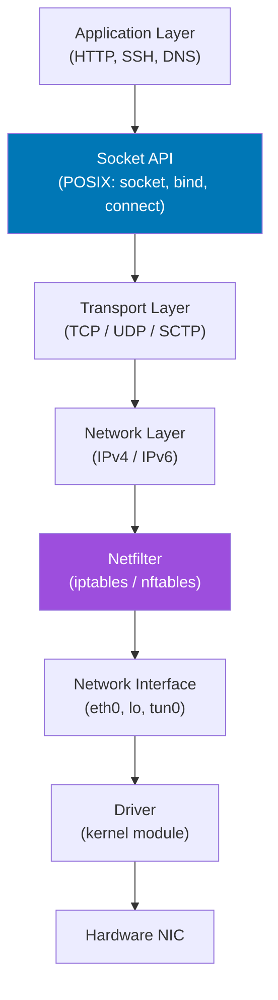

# Linux Networking

## Overview

Linux has one of the most complete and configurable network stacks of any OS. This section covers the full networking model from physical layer up through application sockets, plus Linux-specific tooling.

## Network Stack Architecture



## Essential Commands

=== "Interface Management"

    ```bash
    # Modern: ip command (replaces ifconfig)
    ip addr show              # All interfaces
    ip addr show eth0         # Specific interface
    ip link show              # Link layer info

    # Add/remove IP
    sudo ip addr add 192.168.1.100/24 dev eth0
    sudo ip addr del 192.168.1.100/24 dev eth0

    # Bring interface up/down
    sudo ip link set eth0 up
    sudo ip link set eth0 down
    ```

=== "Routing"

    ```bash
    ip route show             # Routing table
    ip route add default via 192.168.1.1
    ip route add 10.0.0.0/8 via 192.168.1.254

    # Trace the route
    traceroute google.com
    mtr google.com            # Interactive traceroute
    ```

=== "Socket Statistics"

    ```bash
    # Modern netstat replacement
    ss -tulnp                 # TCP+UDP listening, with PID
    ss -tnp                   # All TCP with PID
    ss -s                     # Summary statistics
    ss -o state established   # Established connections

    # Legacy (still useful)
    netstat -tulnp
    netstat -an | grep ESTABLISHED | wc -l
    ```

## Packet Capture

```bash
# Capture on interface
sudo tcpdump -i eth0

# Filter by host
sudo tcpdump -i eth0 host 8.8.8.8

# Filter by port
sudo tcpdump -i eth0 port 443

# Save to file (open in Wireshark)
sudo tcpdump -i eth0 -w /tmp/capture.pcap

# Show packet contents
sudo tcpdump -i eth0 -A -s 0 port 80
```

## iptables / nftables

```bash
# List all rules
sudo iptables -L -v -n --line-numbers

# Allow SSH
sudo iptables -A INPUT -p tcp --dport 22 -j ACCEPT

# Block an IP
sudo iptables -A INPUT -s 192.168.1.100 -j DROP

# NAT (masquerading for containers/VMs)
sudo iptables -t nat -A POSTROUTING -s 10.0.0.0/8 -j MASQUERADE

# Enable IP forwarding (required for routing)
echo 1 | sudo tee /proc/sys/net/ipv4/ip_forward

# Save rules
sudo iptables-save > /etc/iptables/rules.v4
```

## Network Troubleshooting

```bash
# DNS resolution
dig google.com
nslookup google.com
host google.com

# Test connectivity
ping -c 4 8.8.8.8
curl -v https://google.com
wget --spider https://google.com

# Port connectivity
nc -zv google.com 443
telnet google.com 80
nmap -p 22,80,443 target.host

# Bandwidth test
iperf3 -s                    # Server
iperf3 -c server_ip          # Client
```

## Interview Questions

??? question "What happens when you type `curl google.com`?"
    1. Shell forks and execs `curl`
    2. curl calls `getaddrinfo("google.com")` — DNS resolution via stub resolver → `/etc/resolv.conf` nameserver
    3. Kernel performs UDP query to DNS server (port 53)
    4. DNS returns IP address (e.g., 142.250.80.46)
    5. curl calls `socket(AF_INET, SOCK_STREAM, IPPROTO_TCP)` — create socket
    6. `connect()` — kernel initiates TCP 3-way handshake (SYN, SYN-ACK, ACK)
    7. `write()` — sends HTTP GET request
    8. `read()` — reads HTTP response
    9. curl writes to stdout; `close()` TCP FIN/ACK handshake

??? question "What is the difference between TCP and UDP?"
    **TCP**: Connection-oriented, reliable, ordered, flow-controlled. 3-way handshake. Retransmits lost packets. Used for HTTP, SSH, FTP. Higher overhead. **UDP**: Connectionless, unreliable, no ordering guarantee. No handshake. Sender never knows if packet arrived. Used for DNS, DHCP, video streaming, games. Lower latency, lower overhead. Application must implement reliability if needed.
