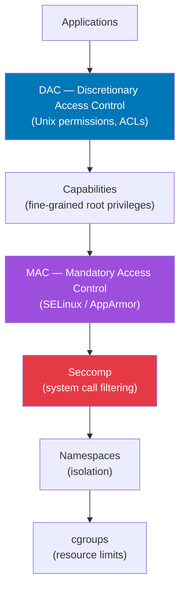

# Linux Security

## Overview

Linux security is multi-layered. Understanding each layer is essential for both securing systems and passing security-related interviews.

## Security Layers



## File Permissions & ACLs

```bash
# Standard permissions
chmod 755 script.sh
chmod u+x,g-w,o-r file
chmod -R 644 /var/www/html/*.html

# ACL — fine-grained per-user/group
getfacl /data/project
setfacl -m u:alice:rwx /data/project
setfacl -m g:devs:r-x /data/project
setfacl -R -m u:alice:rwx /data/project    # Recursive

# Default ACL (inherited by new files)
setfacl -d -m u:alice:rw /data/project
```

## Linux Capabilities

Break down root privileges into ~40 distinct capabilities:

| Capability | Description |
|-----------|-------------|
| `CAP_NET_BIND_SERVICE` | Bind ports < 1024 |
| `CAP_NET_ADMIN` | Network configuration |
| `CAP_SYS_PTRACE` | Debug other processes |
| `CAP_SYS_ADMIN` | Broad system administration |
| `CAP_KILL` | Send signals to any process |
| `CAP_CHOWN` | Change file ownership |
| `CAP_SETUID` | Become any UID |
| `CAP_DAC_OVERRIDE` | Bypass DAC checks |

```bash
# View process capabilities
cat /proc/PID/status | grep -i cap
capsh --decode=<hex_value>

# Give binary capabilities (instead of SUID root)
sudo setcap cap_net_bind_service=ep /usr/bin/node
getcap /usr/bin/node

# Drop capabilities in a process
capsh --drop=cap_sys_admin -- -c "your_command"
```

## SELinux

```bash
# Status
getenforce          # Enforcing / Permissive / Disabled
sestatus

# Set mode (temporary)
sudo setenforce 0   # Permissive (log but don't enforce)
sudo setenforce 1   # Enforcing

# File contexts
ls -Z /etc/passwd   # Show SELinux context
chcon -t httpd_sys_content_t /var/www/html/index.html
restorecon -Rv /var/www/html/   # Restore default contexts

# Audit denials
ausearch -m avc -ts recent
sealert -a /var/log/audit/audit.log
```

## seccomp — System Call Filtering

```bash
# Check if a process uses seccomp
cat /proc/PID/status | grep Seccomp
# 0=disabled, 1=strict, 2=filter

# Docker uses seccomp profiles
docker run --security-opt seccomp=/path/to/profile.json myapp
```

## Interview Questions

??? question "What is the difference between DAC and MAC?"
    **DAC (Discretionary Access Control)**: The owner of a resource decides who can access it (Unix permissions, ACLs). Flexible but relies on user decisions. A misconfigured application can expose data. **MAC (Mandatory Access Control)**: A central policy enforced by the OS regardless of user decisions. SELinux and AppArmor are MAC systems. Even root cannot violate MAC policy. Provides defense in depth against compromised processes.

??? question "What are Linux capabilities and why are they important?"
    Traditionally, Linux had binary privilege: root or non-root. Capabilities divide root's power into ~40 independent units. Instead of giving a process full root, you grant only the specific capability it needs. For example, a web server can bind port 80 with `CAP_NET_BIND_SERVICE` without being root. This follows the principle of least privilege and limits damage from compromised services.
