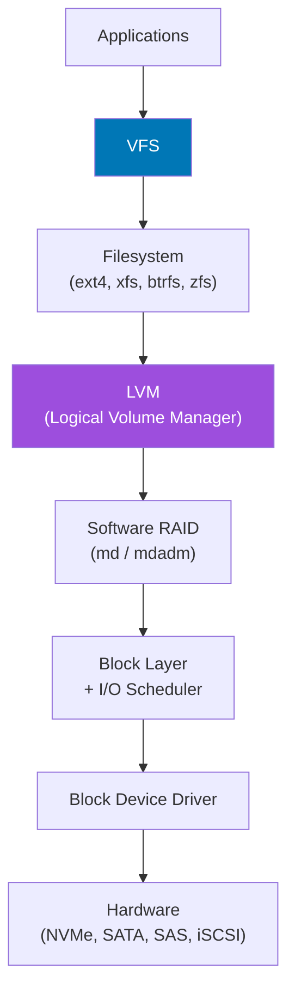

# Storage & Filesystems

## Overview

Linux provides a rich storage stack from raw block devices through logical volume management, RAID, and multiple filesystem types. This section covers the full stack.

## Storage Stack



## Essential Commands

```bash
# Block device overview
lsblk                         # Tree view of block devices
lsblk -f                      # With filesystem info
blkid                         # UUIDs and types
fdisk -l                      # Partition tables (legacy)
parted -l                     # Modern partitioning

# Filesystem usage
df -hT                        # With filesystem type
df -i                         # Inode usage

# Directory space
du -sh /var/log/*             # Size per subdirectory
du -sh /* 2>/dev/null | sort -h  # Find largest

# Mount
mount                         # All mounts
cat /proc/mounts              # Kernel's view
findmnt                       # Tree view of mounts
```

## LVM — Logical Volume Manager

```bash
# LVM Hierarchy: PV → VG → LV

# Physical Volumes
pvcreate /dev/sdb /dev/sdc
pvs                           # List PVs

# Volume Group
vgcreate datavg /dev/sdb /dev/sdc
vgs                           # List VGs

# Logical Volume
lvcreate -L 50G -n datalv datavg
lvs                           # List LVs

# Create filesystem and mount
mkfs.ext4 /dev/datavg/datalv
mount /dev/datavg/datalv /data

# Extend LV online
lvextend -L +20G /dev/datavg/datalv
resize2fs /dev/datavg/datalv   # ext4
xfs_growfs /data               # xfs
```

## I/O Monitoring

```bash
# Real-time I/O statistics
iostat -xz 1

# Per-process I/O
iotop
pidstat -d 1

# Block device queue statistics
cat /sys/block/sda/queue/scheduler
echo "mq-deadline" | sudo tee /sys/block/nvme0n1/queue/scheduler

# Filesystem benchmarking
fio --name=test --rw=randread --bs=4k --size=1G --runtime=60
```

## Interview Questions

??? question "What is the difference between ext4, XFS, and btrfs?"
    **ext4**: Most widely used. Mature, stable, good all-around performance. Lacks built-in checksums, snapshots. Good for general workloads. **XFS**: Excellent for large files and high-throughput workloads. Great multi-threading support. Cannot shrink online. Used by RHEL by default. **btrfs**: Copy-on-write, built-in checksums, snapshots, compression, RAID. More complex. Good for desktop use and systems needing snapshots. Still maturing for some enterprise workloads.

??? question "What is `inode exhaustion` and how do you detect it?"
    Each filesystem has a fixed number of inodes (one per file). When all inodes are used, you cannot create new files even if disk space is available. Detect with `df -i` — if Use% shows 100%, you have inode exhaustion. Solutions: delete files (especially many small log files), use a filesystem with dynamic inodes (btrfs, xfs), or reformat with more inodes (`mkfs.ext4 -N <count>`).
