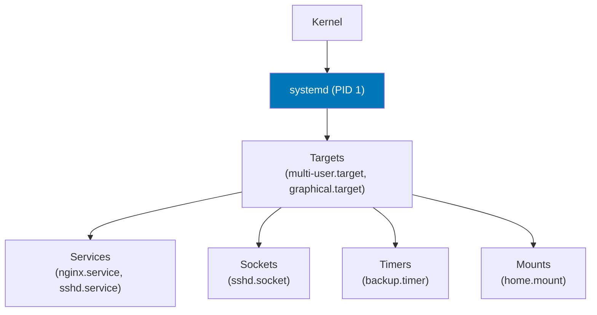

# systemd

## Overview

**systemd** is the init system and service manager used by most modern Linux distributions. It is PID 1 — the first process started by the kernel, and the ancestor of all other processes.

## Core Concepts



## Unit Files

Unit files live in `/etc/systemd/system/` (custom) and `/lib/systemd/system/` (distro).

```ini title="/etc/systemd/system/myapp.service"
[Unit]
Description=My Application Server
Documentation=https://example.com/docs
After=network.target postgresql.service
Wants=postgresql.service

[Service]
Type=simple
User=myapp
Group=myapp
WorkingDirectory=/opt/myapp
ExecStart=/opt/myapp/bin/server --config /etc/myapp/config.yml
ExecReload=/bin/kill -HUP $MAINPID
Restart=always
RestartSec=5s

# Resource limits
CPUQuota=80%
MemoryMax=512M
LimitNOFILE=65536

# Security hardening
NoNewPrivileges=yes
ProtectSystem=strict
ProtectHome=yes
ReadWritePaths=/var/lib/myapp /var/log/myapp
PrivateTmp=yes
CapabilityBoundingSet=CAP_NET_BIND_SERVICE

[Install]
WantedBy=multi-user.target
```

## Essential Commands

```bash
# Service management
systemctl start nginx
systemctl stop nginx
systemctl restart nginx
systemctl reload nginx          # SIGHUP (graceful reload)
systemctl status nginx

# Enable/disable at boot
systemctl enable nginx
systemctl disable nginx
systemctl enable --now nginx    # Enable + start immediately

# List services
systemctl list-units --type=service
systemctl list-units --type=service --state=failed

# View unit file
systemctl cat nginx
systemctl show nginx            # All properties

# Dependencies
systemctl list-dependencies nginx
systemctl list-dependencies --reverse nginx   # What depends on nginx

# Reload after unit file changes
systemctl daemon-reload
```

## journald — Log Management

```bash
# All logs
journalctl

# Follow live
journalctl -f

# Specific service
journalctl -u nginx
journalctl -u nginx -f

# Since boot
journalctl -b                   # This boot
journalctl -b -1                # Previous boot
journalctl --list-boots

# Time range
journalctl --since "1 hour ago"
journalctl --since "2024-01-15 09:00" --until "2024-01-15 10:00"

# Priority (0=emerg, 3=err, 6=info, 7=debug)
journalctl -p err               # Errors and above
journalctl -p 0..3              # Emergency to errors

# Disk usage
journalctl --disk-usage
journalctl --vacuum-size=500M   # Trim to 500MB
journalctl --vacuum-time=30d    # Remove logs older than 30 days
```

## Timers (Cron replacement)

```ini title="/etc/systemd/system/backup.timer"
[Unit]
Description=Daily Backup Timer

[Timer]
OnCalendar=daily
OnCalendar=Mon..Fri 02:30:00
Persistent=true                 # Run if missed while offline

[Install]
WantedBy=timers.target
```

```bash
systemctl list-timers           # All active timers
systemctl enable --now backup.timer
```

## Interview Questions

??? question "What is the difference between `systemctl restart` and `systemctl reload`?"
    **`restart`**: Stops and starts the service. All connections are dropped, new process started. **`reload`**: Sends SIGHUP (or `ExecReload` command) to the running process, asking it to re-read its configuration without stopping. For nginx, this means zero-downtime config reload. Not all services support reload.

??? question "What does `After=network.target` mean in a unit file?"
    `After=` controls **ordering** — this service starts after `network.target` is reached. It does NOT create a dependency. Use `Requires=` or `Wants=` for actual dependency (if network fails, should this service fail?). `Wants=` is soft (failure OK), `Requires=` is hard (this service also fails).
