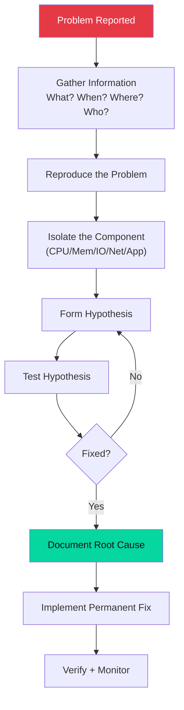

# Troubleshooting

## Overview

Effective troubleshooting is a systematic process, not guesswork. This section covers methodologies, tools, and common problem patterns.

## Troubleshooting Methodology



## Quick Triage — First 5 Minutes

```bash
# 1. System overview
uptime                         # Load average + uptime
uname -r                       # Kernel version
hostnamectl                    # OS details

# 2. Resource snapshot
free -h                        # Memory
df -h                          # Disk
iostat -x 1 3                  # I/O
vmstat 1 5                     # CPU/mem/swap overview

# 3. Recent errors
dmesg | tail -50               # Kernel messages
journalctl -p err -b --no-pager | tail -30  # System errors since boot

# 4. Process health
ps aux --sort=-%cpu | head -15 # CPU hogs
ps aux --sort=-%mem | head -15 # Memory hogs

# 5. Network
ss -tulnp                      # Listening ports
ip addr show                   # Interface status
```

## Common Problem Patterns

=== "High CPU"

    ```bash
    # Identify the process
    top                         # Press P to sort by CPU
    ps aux --sort=-%cpu | head -10

    # What is it doing?
    strace -p PID               # System calls
    perf top -p PID             # CPU hotspots
    ls -l /proc/PID/fd          # Open files

    # CPU runqueue length
    vmstat 1 | awk '{print $1}'  # r column

    # Is it kernel or user time?
    mpstat 1 | head -5
    ```

=== "High Memory"

    ```bash
    # What's using memory?
    ps aux --sort=-%mem | head -10
    free -h
    cat /proc/meminfo | grep -E 'MemFree|Buffers|Cached|Slab'

    # Is there a memory leak?
    watch -n 5 'ps aux --sort=-%mem | head -5'

    # OOM kills?
    journalctl -k | grep -i "out of memory"
    dmesg | grep -i "oom killer"

    # Per-process detailed
    pmap -x PID | tail -1
    ```

=== "Disk Full"

    ```bash
    # Find the full filesystem
    df -h

    # Find what's large
    du -sh /* 2>/dev/null | sort -h | tail -10
    du -sh /var/log/* | sort -h | tail -10

    # Large files
    find / -size +1G -type f 2>/dev/null | sort -k5 -n

    # Files open but deleted (still consuming space)
    lsof | grep deleted | awk '{print $7, $9}' | sort -rn | head -10
    # Fix: restart the process holding the file

    # Inode exhaustion?
    df -i
    ```

=== "Service Not Starting"

    ```bash
    # Check status
    systemctl status myservice
    journalctl -u myservice -n 50 --no-pager

    # Syntax check
    nginx -t
    apache2 -t

    # Is port in use?
    ss -tlnp | grep :80

    # File permissions
    ls -la /etc/myservice/
    namei -l /path/to/config

    # SELinux denial?
    ausearch -m avc -ts recent | grep myservice
    ```

=== "Network Issue"

    ```bash
    # Connectivity layers
    ip link show               # L2 — link layer
    ip addr show               # L3 — IP address
    ping 192.168.1.1           # Gateway
    ping 8.8.8.8               # Internet (IP)
    ping google.com            # DNS + Internet

    # Route issue?
    ip route show
    traceroute 8.8.8.8

    # DNS issue?
    dig @8.8.8.8 google.com    # Test specific resolver
    cat /etc/resolv.conf

    # Firewall blocking?
    sudo iptables -L -v -n
    sudo nft list ruleset
    ```

## Log Analysis

```bash
# System logs
journalctl -b                         # This boot
journalctl --since "2 hours ago"
journalctl -u sshd -f                 # Follow SSH logs

# Auth failures
journalctl -u ssh | grep "Failed"
lastb                                 # Failed logins
last                                  # Successful logins

# Kernel messages
dmesg --level=err,warn
dmesg -T | grep -i error

# Application logs
tail -f /var/log/nginx/error.log
tail -f /var/log/mysql/error.log
grep -i "error\|critical\|fatal" /var/log/app.log | tail -50
```

## Useful Debugging Tools

| Tool | Purpose |
|------|---------|
| `strace` | Trace system calls of a process |
| `ltrace` | Trace library calls |
| `lsof` | List open files and network connections |
| `ss` / `netstat` | Socket statistics |
| `tcpdump` | Packet capture |
| `perf` | CPU profiling and hardware counters |
| `gdb` | GNU debugger — attach to running process |
| `valgrind` | Memory error detection |
| `dstat` | Combined system resource stats |
| `sar` | System activity reporter (historical) |

## Interview Questions

??? question "A production server is slow. Walk me through your investigation."
    1. **`uptime`** — Check load average trend (is it increasing? flat high?) 2. **`free -h`** — Is there memory pressure? Is swap being used? 3. **`vmstat 1`** — CPU (r=runqueue, b=blocked), memory (si/so=swap), I/O (bi/bo) 4. **`iostat -x 1`** — Is disk I/O saturated? (%util high? await high?) 5. **`ps aux --sort=-%cpu`** — Which processes consume resources? 6. **`ss -tulnp`** — Any unexpected connections/listeners? 7. **`journalctl -p err -b`** — Any application or kernel errors? 8. Form hypothesis based on evidence. Test. Document.

??? question "A file is deleted but disk usage hasn't decreased. Why?"
    A file's data blocks are only freed when the **link count reaches 0 AND all file descriptors to it are closed**. If a process still has the file open (e.g., a log file deleted during log rotation, but the daemon hasn't been restarted), the data blocks remain allocated. Use `lsof | grep deleted` to find such files. The fix is to restart or send SIGHUP to the process holding the file descriptor.
